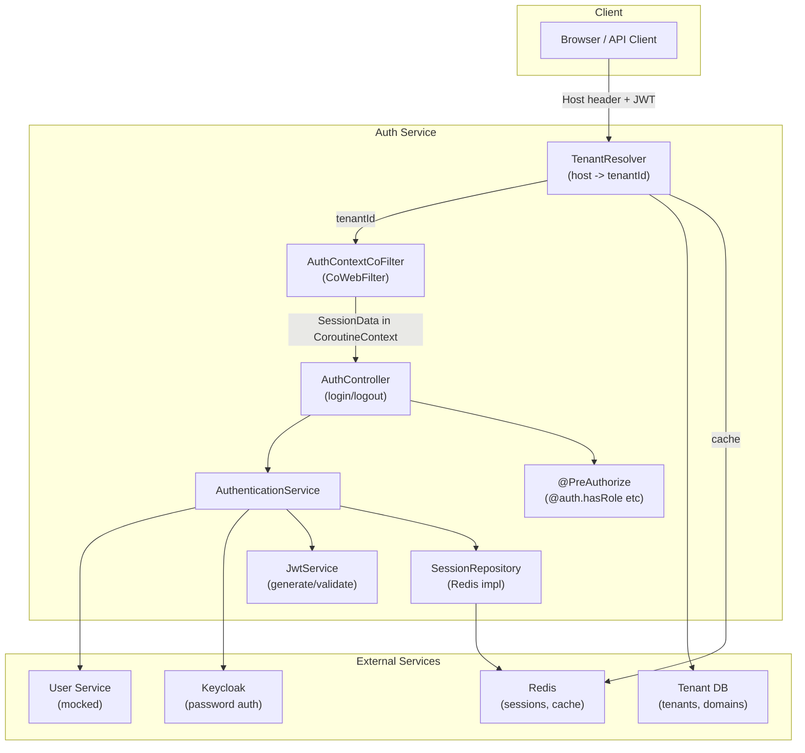
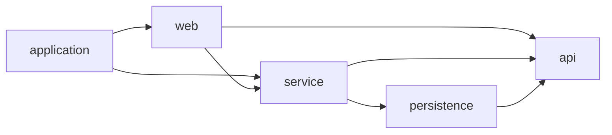

# Multi-Tenant Auth Service Implementation Plan

## Context

The conversation in the transcript established a detailed design for a multi-tenant authentication service. No code exists yet -- the `auth-service` folder needs to be created from scratch at `c:\_projects\cursor-example-projects\auth-service`.

The existing `[core-library](core-library)` project provides the template for project structure, versions, and convention plugins (Spring Boot 4.0.2, Kotlin 2.3.10, Java 25, Gradle 9.3.1).

## Architecture Overview




## Key Design Decisions (from transcript)

- **JWT (minimal)**: Contains only `userId`, `sessionId`, `tenantId`, `issuedAt`, `expiresAt`
- **Redis sessions**: Full session data (roles, permissions, scopes, Keycloak tokens) stored with TTL auto-expiration
- **Tenant resolution**: Database-driven with two Spring-profile-based implementations:
  - `ProductionTenantResolverService` (`@Profile("!local")`) -- subdomain/custom domain/CNAME lookup with Redis cache
  - `LocalTenantResolverService` (`@Profile("local")`) -- localhost subdomain parsing + DB lookup
  - Default/guest tenant has no subdomain; all others require one
- **Coroutine context**: `AuthContext` as `AbstractCoroutineContextElement` (not ThreadLocal), `CoWebFilter` (not `WebFilter`/`Mono`)
- **Controller parameter**: `SessionData` injected as a controller method parameter
- **Security annotations**: SpEL via `@Component("auth") AuthSecurityExpressions` bean, used as `@PreAuthorize("@auth.hasRole('ADMIN')")`, plus convenience meta-annotations (`@RequireAdmin`, etc.)
- **Sliding session**: Token auto-refreshed near expiry, configurable via `ConfigurationProperties`
- **Session invalidation**: Per-session, per-tenant, or all-sessions logout; token blacklisting
- **Keycloak**: BFF pattern -- passwords stored ONLY in Keycloak. Flow: email -> User Service (mocked) -> userId -> Keycloak (validates password) -> Redis session -> application JWT
- **User Service**: Mocked with static data (`MockedUserServiceClient`), Ktor async client later

## Project Structure

Create at `c:\_projects\cursor-example-projects\auth-service/`:

```
auth-service/
  build.gradle.kts
  settings.gradle.kts
  gradle.properties
  gradle/
    libs.versions.toml
    wrapper/ (copy from core-library)
  buildSrc/
    build.gradle.kts
    settings.gradle.kts
    src/main/kotlin/
      auth-service.kotlin-conventions.gradle.kts
      auth-service.spring-module-conventions.gradle.kts

  # Modules
  api/                           # Request/response DTOs, shared value objects (AuthToken), exceptions
  persistence/                   # DB entities, Redis data models, repository interfaces + implementations
  service/                       # Internal domain objects (SessionData, Tenant, AuthContext), service logic
  web/                           # Controllers, filters, security config, annotations
  application/                   # Boot entry point, configuration, application.yml
```

No `platform-conventions` plugin needed -- the project uses `core-library` as the platform dependency for version management (Spring Boot BOM etc.).

## Module Dependency Graph




Internal domain objects (e.g. `SessionData`, `Tenant`, `AuthContext`) live in `service` and do NOT propagate to `web` or `application`. The `web` module interacts with `service` via DTOs from `api`.

## Key Files and Code Patterns

### Version catalog (`gradle/libs.versions.toml`)

- Spring Boot 4.0.2, Kotlin 2.3.10, core-library 0.0.1-SNAPSHOT
- Dependencies: spring-boot-starter-security, spring-boot-starter-data-redis-reactive, spring-session-data-redis, jjwt (io.jsonwebtoken), ktor-client
- Uses `core-library` platform (BOM) for dependency version management -- no local platform module needed

### `api` module

- **Request/Response DTOs**: LoginRequest, LoginResponse, LogoutRequest, TenantSwitchRequest, UserResolveResponse, UserDetailsResponse
- **Shared value objects**: `AuthToken` (userId, sessionId, tenantId, issuedAt, expiresAt)
- **Exception classes**: TenantNotFoundException, SessionExpiredException, AuthenticationException, etc.

### `persistence` module

- **Database entities**: TenantEntity, TenantCustomDomainEntity, BaseDomainEntity (JPA/R2DBC annotations)
- **Redis data model**: SessionRedisData (serializable representation for Redis storage)
- **Repository interfaces + implementations**:
  - `SessionRepository` (interface) + `RedisSessionRepository` -- Redis keys: `session:{tenantId}:{sessionId}`, `user_sessions:{userId}`, `user_tenant_sessions:{userId}:{tenantId}`
  - `TenantRepository` (interface) + R2DBC impl -- findBySubdomain, findByCustomDomain, findDefault, findById
  - `BaseDomainRepository` (interface) + R2DBC impl
  - `TenantResolverCache` (interface) + `RedisTenantResolverCache` -- get/put/invalidate by host, getBaseDomains

### `service` module (internal domain objects stay here)

- **Internal domain objects** (NOT exposed to web/application):
  - `SessionData` -- sessionId, userId, tenantId, username, email, roles, permissions, scopes, keycloakAccessToken, keycloakRefreshToken, createdAt, lastAccessedAt, expiresAt
  - `Tenant` -- tenantId, name, subdomain (nullable for default), customDomains, isDefault, isActive
  - `AuthContext` extends `AbstractCoroutineContextElement` -- holds AuthToken + SessionData
- **Service interfaces + implementations**:
  - `TenantResolverService` -- resolveTenantId(host), resolveTenant(host)
    - `ProductionTenantResolverService` (`@Profile("!local")`) -- DB + CNAME + Redis cache
    - `LocalTenantResolverService` (`@Profile("local")`) -- localhost subdomain + DB
  - `DnsResolverService` -- resolveCnameChain(host)
    - `ProductionDnsResolverService` / `LocalDnsResolverService`
  - `AuthenticationService` -- orchestrates login flow
  - `JwtService` -- generate/validate JWT using jjwt
  - `SessionInvalidationService` -- logout, logoutFromTenant, logoutFromAllTenants, blacklistToken
  - `KeycloakClient` + `KeycloakClientImpl` -- Ktor HttpClient, password grant via Keycloak
  - `UserServiceClient` + `MockedUserServiceClient` (`@Profile("local", "dev")`) -- hardcoded 3 users (john, jane, admin)
  - `SlidingSessionCoFilter` -- auto-refresh tokens near expiry

### `web` module

- `AuthContextCoFilter` (extends `CoWebFilter`) -- resolves tenant, loads session, populates coroutine context
- `SessionAuthenticationConverter` -- converts JWT to Spring `Authentication` with `SessionData` as principal
- `AuthSecurityExpressions` (`@Component("auth")`) -- hasRole, hasAnyRole, hasAllRoles, hasPermission, hasAnyPermission, hasAllPermissions, isTenant, isOwner
- Convenience annotations: `@RequireAdmin`, `@RequireUser`, etc.
- `SecurityConfig` -- `@EnableWebFluxSecurity`, `@EnableReactiveMethodSecurity`, permit `/auth/login`, `/auth/register`
- `AuthController` -- login, logout (with `logoutFromAllTenants`/`logoutFromAllSessions` flags), tenant-switch endpoint
- `SessionDataArgumentResolver` -- resolves `SessionData` parameter in controllers

### `application` module

- Spring Boot entry point
- `SessionProperties` (`auth.session.*`) -- tokenExpirationMinutes, refreshWindowMinutes, sessionTimeoutMinutes, slidingSessionEnabled
- `KeycloakProperties` (`auth.keycloak.*`) -- serverUrl, realm, clientId, clientSecret
- `TenantProperties` (`auth.tenant.*`) -- baseDomains list (loaded from DB), defaultTenantId
- `application.yml` and `application-local.yml`

### Database schema (for tenant data)

- `tenants` table -- tenant_id, name, subdomain (unique, nullable), is_default, is_active
- `tenant_custom_domains` table -- domain (PK), tenant_id (FK), is_verified
- `base_domains` table -- domain (PK), is_primary
- Seed data: default (guest), acme, globex tenants; example.com base domain

## Redis Key Structure

- `session:{tenantId}:{sessionId}` -> SessionData JSON (with TTL)
- `user_sessions:{userId}` -> Set of sessionIds
- `user_tenant_sessions:{userId}:{tenantId}` -> Set of sessionIds
- `blacklist:{tokenHash}` -> expiresAt (with TTL)
- `tenant_cache:{host}` -> Tenant JSON (15 min TTL)
- `base_domains` -> Set of domain strings (1h TTL)

