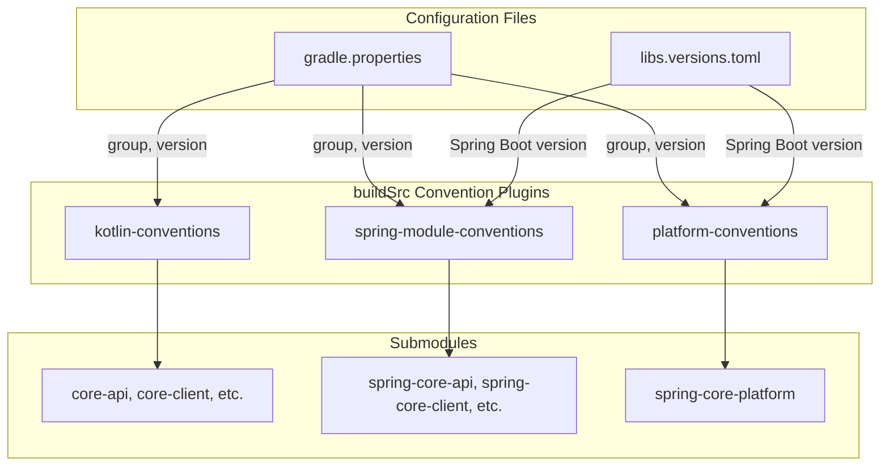

# Core Library Gradle buildSrc Restructuring

## Current State

The project has 13 submodules using `allprojects` and `subprojects` blocks in the root [build.gradle.kts](core-library/build.gradle.kts):

- `allprojects`: Sets `group`, `version`, and repositories
- `subprojects`: Applies Kotlin JVM plugin and Java 21 toolchain (except platform modules)
- Spring Boot version `4.0.2` is hardcoded in [spring-core-platform/build.gradle.kts](core-library/spring-core-platform/build.gradle.kts) and [spring-core-application/build.gradle.kts](core-library/spring-core-application/build.gradle.kts)

## Target Architecture




---

## Implementation Steps

### 1. Create `gradle.properties`

**File:** `core-library/gradle.properties`

```properties
group=com.example.core
version=0.0.1-SNAPSHOT
```

### 2. Create Version Catalog

**File:** `core-library/gradle/libs.versions.toml`

```toml
[versions]
spring-boot = "4.0.2"
kotlin = "2.1.0"

[libraries]
spring-boot-starter = { module = "org.springframework.boot:spring-boot-starter" }
spring-boot-starter-web = { module = "org.springframework.boot:spring-boot-starter-web" }
spring-boot-starter-webflux = { module = "org.springframework.boot:spring-boot-starter-webflux" }
spring-boot-starter-validation = { module = "org.springframework.boot:spring-boot-starter-validation" }
spring-boot-starter-data-jpa = { module = "org.springframework.boot:spring-boot-starter-data-jpa" }
spring-boot-dependencies = { module = "org.springframework.boot:spring-boot-dependencies", version.ref = "spring-boot" }

[plugins]
kotlin-jvm = { id = "org.jetbrains.kotlin.jvm", version.ref = "kotlin" }
spring-boot = { id = "org.springframework.boot", version.ref = "spring-boot" }
```

### 3. Create buildSrc Structure

#### 3.1 buildSrc settings

**File:** `core-library/buildSrc/settings.gradle.kts`

```kotlin
dependencyResolutionManagement {
    versionCatalogs {
        create("libs") {
            from(files("../gradle/libs.versions.toml"))
        }
    }
}
```

#### 3.2 buildSrc build file

**File:** `core-library/buildSrc/build.gradle.kts`

```kotlin
plugins {
    `kotlin-dsl`
}

repositories {
    gradlePluginPortal()
    mavenCentral()
}

dependencies {
    implementation(libs.plugins.kotlin.jvm.get().pluginId + ":" + libs.plugins.kotlin.jvm.get().version)
    implementation(libs.plugins.spring.boot.get().pluginId + ":" + libs.plugins.spring.boot.get().version)
}
```

#### 3.3 Kotlin Conventions Plugin

**File:** `core-library/buildSrc/src/main/kotlin/core-library.kotlin-conventions.gradle.kts`

For framework-agnostic core modules (`core-api`, `core-client`, etc.):

```kotlin
plugins {
    id("org.jetbrains.kotlin.jvm")
}

group = property("group") as String
version = property("version") as String

repositories {
    mavenCentral()
    mavenLocal()
}

java {
    toolchain {
        languageVersion.set(JavaLanguageVersion.of(21))
    }
}

kotlin {
    compilerOptions {
        jvmTarget.set(org.jetbrains.kotlin.gradle.dsl.JvmTarget.JVM_21)
    }
}
```

#### 3.4 Spring Module Conventions Plugin

**File:** `core-library/buildSrc/src/main/kotlin/core-library.spring-module-conventions.gradle.kts`

For Spring implementation modules (`spring-core-api`, `spring-core-client`, etc.):

```kotlin
plugins {
    id("core-library.kotlin-conventions")
}

// Spring modules inherit kotlin-conventions and add platform dependency
```

#### 3.5 Platform Conventions Plugin

**File:** `core-library/buildSrc/src/main/kotlin/core-library.platform-conventions.gradle.kts`

For the `spring-core-platform` BOM module:

```kotlin
plugins {
    id("java-platform")
}

group = property("group") as String
version = property("version") as String

repositories {
    mavenCentral()
    mavenLocal()
}
```

### 4. Update Root Build File

**File:** `core-library/build.gradle.kts`

Replace the entire content with:

```kotlin
// Root project - no plugins applied
// Convention plugins are defined in buildSrc and applied by submodules
```

### 5. Update Submodule Build Files

#### Core Modules (apply kotlin-conventions)

**Example:** `core-library/core-api/build.gradle.kts`

```kotlin
plugins {
    id("core-library.kotlin-conventions")
}

dependencies {
    // module-specific dependencies
}
```

Apply the same pattern to: `core-client`, `core-persistence`, `core-service`, `core-web`, `core-application`

#### Spring Platform Module

**File:** `core-library/spring-core-platform/build.gradle.kts`

```kotlin
plugins {
    id("core-library.platform-conventions")
}

javaPlatform {
    allowDependencies()
}

dependencies {
    api(platform(libs.spring.boot.dependencies))
}
```

#### Spring Implementation Modules

**Example:** `core-library/spring-core-api/build.gradle.kts`

```kotlin
plugins {
    id("core-library.spring-module-conventions")
}

dependencies {
    api(platform(project(":spring-core-platform")))
    api(project(":core-api"))
    implementation(libs.spring.boot.starter.validation)
}
```

Apply similar pattern to: `spring-core-client`, `spring-core-persistence`, `spring-core-service`, `spring-core-web`

#### Spring Application Module

**File:** `core-library/spring-core-application/build.gradle.kts`

```kotlin
plugins {
    id("core-library.spring-module-conventions")
    alias(libs.plugins.spring.boot)
}

tasks.named<org.springframework.boot.gradle.tasks.bundling.BootJar>("bootJar") {
    enabled = false
}

tasks.named<Jar>("jar") {
    enabled = true
}

dependencies {
    api(platform(project(":spring-core-platform")))
    api(project(":core-application"))
    api(project(":spring-core-web"))
    implementation(libs.spring.boot.starter)
}
```

---

## Files to Create


| File                                                                         | Purpose                                  |
| ---------------------------------------------------------------------------- | ---------------------------------------- |
| `gradle.properties`                                                          | Project group and version                |
| `gradle/libs.versions.toml`                                                  | Version catalog with Spring Boot version |
| `buildSrc/settings.gradle.kts`                                               | Enable version catalog in buildSrc       |
| `buildSrc/build.gradle.kts`                                                  | buildSrc dependencies                    |
| `buildSrc/src/main/kotlin/core-library.kotlin-conventions.gradle.kts`        | Kotlin JVM convention plugin             |
| `buildSrc/src/main/kotlin/core-library.spring-module-conventions.gradle.kts` | Spring module convention plugin          |
| `buildSrc/src/main/kotlin/core-library.platform-conventions.gradle.kts`      | Platform convention plugin               |


## Files to Modify


| File                                       | Changes                                                   |
| ------------------------------------------ | --------------------------------------------------------- |
| `build.gradle.kts`                         | Remove allprojects/subprojects, simplify to empty root    |
| `core-api/build.gradle.kts`                | Add kotlin-conventions plugin                             |
| `core-client/build.gradle.kts`             | Add kotlin-conventions plugin                             |
| `core-persistence/build.gradle.kts`        | Add kotlin-conventions plugin                             |
| `core-service/build.gradle.kts`            | Add kotlin-conventions plugin                             |
| `core-web/build.gradle.kts`                | Add kotlin-conventions plugin                             |
| `core-application/build.gradle.kts`        | Add kotlin-conventions plugin                             |
| `spring-core-platform/build.gradle.kts`    | Use platform-conventions plugin, use version catalog      |
| `spring-core-api/build.gradle.kts`         | Use spring-module-conventions plugin, use version catalog |
| `spring-core-client/build.gradle.kts`      | Use spring-module-conventions plugin, use version catalog |
| `spring-core-persistence/build.gradle.kts` | Use spring-module-conventions plugin, use version catalog |
| `spring-core-service/build.gradle.kts`     | Use spring-module-conventions plugin, use version catalog |
| `spring-core-web/build.gradle.kts`         | Use spring-module-conventions plugin, use version catalog |
| `spring-core-application/build.gradle.kts` | Use spring-module-conventions plugin, use version catalog |


---

## Benefits

1. **Declarative Configuration**: Each submodule explicitly declares which conventions it uses
2. **Better IDE Support**: Convention plugins are easier for IDEs to analyze
3. **Centralized Versions**: Spring Boot version is defined once in the version catalog
4. **Reusable Plugins**: Convention plugins can be extracted to a standalone project later
5. **Cleaner Root Build**: No magic `subprojects`/`allprojects` blocks

---

## Validation

After all changes are complete, run the following commands from the `core-library` directory to validate the build:

### 1. Verify Project Structure

```bash
./gradlew projects
```

This should list all 13 submodules without errors.

### 2. Verify Dependency Resolution

```bash
./gradlew dependencies --configuration compileClasspath
```

This validates that the version catalog and platform dependencies resolve correctly.

### 3. Compile All Modules

```bash
./gradlew assemble
```

This compiles all source code and packages the artifacts. All modules should build successfully.

### 4. Run Full Build (if tests exist)

```bash
./gradlew build
```

This runs compilation, tests, and verification tasks.

### Expected Outcomes

- All commands complete with `BUILD SUCCESSFUL`
- No unresolved dependency warnings
- Version catalog entries (`libs.spring.boot.*`) resolve to Spring Boot 4.0.2
- `group` and `version` are correctly read from `gradle.properties` for all modules

