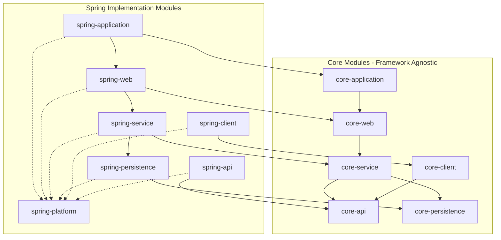

# Core Library Gradle Multi-Module Project

## Project Location

The entire project will be created in `./core-library/` folder within the workspace:

- **Workspace**: `c:\_projects\cursor-example-projects`
- **Project root**: `c:\_projects\cursor-example-projects\core-library`

## Project Structure

All modules live at the root level (no `impl/` folder):

```
./core-library/
├── core-api/
├── core-client/
├── core-persistence/
├── core-service/
├── core-web/
├── core-application/
├── spring-core-platform/
├── spring-core-api/
├── spring-core-client/
├── spring-core-persistence/
├── spring-core-service/
├── spring-core-web/
├── spring-core-application/
├── build.gradle.kts
├── settings.gradle.kts
└── gradle/
    └── wrapper/
```

## Module Dependency Graph




## Configuration

### 1. Root `settings.gradle.kts`

- Root project name: `core-library`
- Include all 12 modules
- Configure Gradle 9.3.1 toolchain

### 2. Root `build.gradle.kts`

- Apply `kotlin("jvm")` plugin to all subprojects (using Gradle's built-in Kotlin version)
- Set Java 21 toolchain for all modules
- Configure common repository (mavenCentral, mavenLocal)
- Group: `com.example.core`

### 3. `spring-core-platform/build.gradle.kts`

- Use `java-platform` plugin (no source code)
- Import Spring Boot 4.0.2 BOM via `platform("org.springframework.boot:spring-boot-dependencies:4.0.2")`
- Optionally constrain other shared versions

### 4. Core Module `build.gradle.kts` Files

Each core module:

- Applies `kotlin("jvm")` (inherited from root)
- Has **no** Spring/framework dependencies
- Only depends on other core modules as specified


| Module             | Dependencies                   |
| ------------------ | ------------------------------ |
| `core-api`         | none                           |
| `core-client`      | `core-api`                     |
| `core-persistence` | none                           |
| `core-service`     | `core-api`, `core-persistence` |
| `core-web`         | `core-service`                 |
| `core-application` | `core-web`                     |


### 5. Spring Module `build.gradle.kts` Files

Each spring module:

- Depends on `platform(project(":spring-core-platform"))` for version alignment
- Depends on the matching `core-*` module
- May depend on other `spring-*` modules where needed
- Adds Spring Boot starters as appropriate


| Module                    | Core Dependency                           | Spring Dependencies                      |
| ------------------------- | ----------------------------------------- | ---------------------------------------- |
| `spring-core-api`         | `core-api`                                | (optional: validation)                   |
| `spring-core-client`      | `core-client`                             | `spring-boot-starter-webflux` or similar |
| `spring-core-persistence` | `core-persistence`                        | `spring-boot-starter-data-jpa`           |
| `spring-core-service`     | `core-service`, `spring-core-persistence` | `spring-boot-starter`                    |
| `spring-core-web`         | `core-web`, `spring-core-service`         | `spring-boot-starter-web`                |
| `spring-core-application` | `core-application`, `spring-core-web`     | `spring-boot-starter` + Boot plugin      |


## Example Interfaces in Core Modules

Each core module will contain a minimal example interface/class:

- **core-api**: `ExampleRequest`, `ExampleResponse` interfaces
- **core-client**: `ExampleClient` interface
- **core-persistence**: `ExampleEntity` interface
- **core-service**: `ExampleService` interface
- **core-web**: `ExampleRestController` interface
- **core-application**: `ExampleApplication` interface

Package structure: `com.example.core.<module>` (e.g., `com.example.core.api`)

## Files to Create

All paths relative to `./core-library/`:

1. `./core-library/settings.gradle.kts` - project includes and naming
2. `./core-library/build.gradle.kts` - root build with shared config
3. `./core-library/gradle/wrapper/gradle-wrapper.properties` - Gradle 9.3.1
4. 12 module directories inside `./core-library/`, each with:
  - `build.gradle.kts`
  - `src/main/kotlin/com/example/core/<module>/` with example files (core modules only)

## Key Design Decisions

- **No framework deps in core**: Core modules remain 100% framework-agnostic
- **Platform for versions**: `spring-core-platform` centralizes all Spring/Boot versions
- **Flat structure**: All modules at root level for simplicity
- **Kotlin with Java 21**: Uses Gradle's built-in Kotlin, targets JVM 21
- **Future-proof**: Adding Micronaut later means creating `micronaut-*` modules + `micronaut-platform`, no changes to core

