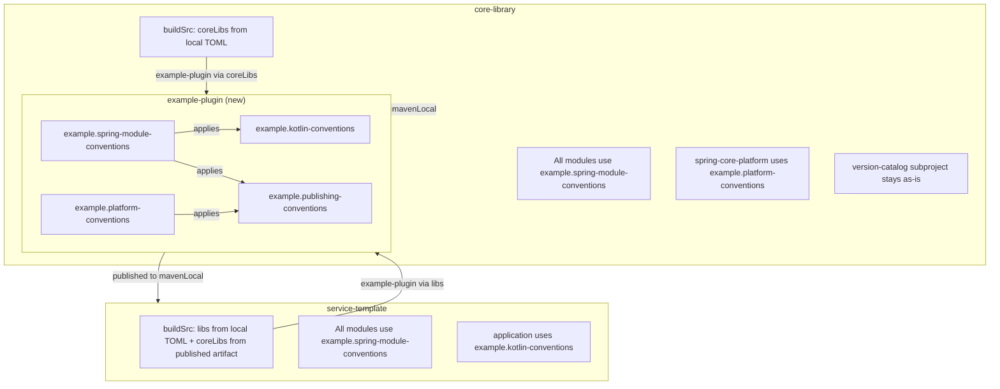

# Implement Shared Gradle Plugin

## Context

Both `core-library` and `service-template` duplicate significant Gradle configuration in their `buildSrc` convention plugins: Kotlin/JVM toolchain setup, Maven publishing scaffolding, and Spring module composition. Extracting these into a shared plugin eliminates duplication while keeping the version catalog in `core-library` as the single source of truth for transitive dependency versions.

## Plugin Architecture




## 1. Plugin Project Structure

Create `./example-plugin/` with the following layout:

```
example-plugin/
  build.gradle.kts
  settings.gradle.kts
  gradle.properties
  gradle/
    libs.versions.toml
    wrapper/
      gradle-wrapper.properties
  src/main/kotlin/
    example.kotlin-conventions.gradle.kts
    example.publishing-conventions.gradle.kts
    example.spring-module-conventions.gradle.kts
    example.platform-conventions.gradle.kts
```

## 2. Plugin Build Configuration

`**example-plugin/gradle/libs.versions.toml**` -- single source of truth for the Kotlin Gradle plugin version used by the convention plugins:

```toml
[versions]
kotlin = "2.3.10"
```

`**example-plugin/settings.gradle.kts**`:

```kotlin
rootProject.name = "example-plugin"
```

Note: no explicit `dependencyResolutionManagement` block is needed. The `kotlin-dsl` plugin automatically resolves `gradle/libs.versions.toml` as the default `libs` catalog.

`**example-plugin/build.gradle.kts**` -- uses `libs.versions.kotlin` from the TOML:

```kotlin
plugins {
    `kotlin-dsl`
    `maven-publish`
}

group = "com.example.gradle"
version = "0.0.1-SNAPSHOT"

repositories {
    gradlePluginPortal()
    mavenCentral()
}

dependencies {
    implementation("org.jetbrains.kotlin:kotlin-gradle-plugin:${libs.versions.kotlin.get()}")
}

publishing {
    repositories {
        mavenLocal()
    }
}
```

`**example-plugin/gradle.properties**`:

```properties
group=com.example.gradle
version=0.0.1-SNAPSHOT
```

**Gradle wrapper**: same version (9.3.1) as both projects.

## 3. Convention Plugins -- Contents

### 3a. `example.kotlin-conventions.gradle.kts`

Extracts the common Kotlin/JVM setup from both projects. Does NOT include publishing (following the more modular service-template pattern). Used directly only by modules that should not be published (e.g. service-template's `application`):

```kotlin
plugins {
    id("org.jetbrains.kotlin.jvm")
}

group = property("group") as String
version = property("version") as String

repositories {
    mavenCentral()
    mavenLocal()
}

java {
    toolchain {
        languageVersion.set(JavaLanguageVersion.of(25))
    }
}

kotlin {
    compilerOptions {
        jvmTarget.set(org.jetbrains.kotlin.gradle.dsl.JvmTarget.JVM_25)
    }
}
```

### 3b. `example.publishing-conventions.gradle.kts`

Base Maven publishing setup shared by both projects. Supports both `javaPlatform` and `java` components. Always publishes to mavenLocal. For non-SNAPSHOT versions, conditionally adds a remote repository configured via `gradle.properties` (following the pattern from [core-library.publishing-conventions](core-library/buildSrc/src/main/kotlin/core-library.publishing-conventions.gradle.kts)):

```kotlin
plugins {
    `maven-publish`
}

publishing {
    publications {
        create<MavenPublication>("maven") {
            afterEvaluate {
                val component = components.findByName("javaPlatform")
                    ?: components.findByName("java")
                component?.let { from(it) }
            }
            pom {
                name.set(project.name)
                description.set("${project.group} module: ${project.name}")
            }
        }
    }
    repositories {
        mavenLocal()

        if (!version.toString().endsWith("-SNAPSHOT")) {
            findProperty("publishing.repository.url")?.let { repoUrl ->
                maven {
                    name = findProperty("publishing.repository.name") as String? ?: "Remote"
                    url = uri(repoUrl)
                    credentials {
                        username = System.getenv("PUBLISH_USERNAME")
                            ?: findProperty("publishing.repository.username") as String?
                        password = System.getenv("PUBLISH_PASSWORD")
                            ?: findProperty("publishing.repository.password") as String?
                    }
                }
            }
        }
    }
}
```

Each project configures the remote repo via its own `gradle.properties`:

- core-library: `publishing.repository.url=https://maven.pkg.github.com/your-org/core-library`, `publishing.repository.name=GitHubPackages`
- service-template: `publishing.repository.url=https://your-artifactory.example.com/repo`, `publishing.repository.name=Artifactory`

Credentials are resolved from env vars `PUBLISH_USERNAME` / `PUBLISH_PASSWORD` or from properties `publishing.repository.username` / `publishing.repository.password`.

### 3c. `example.spring-module-conventions.gradle.kts`

Composes kotlin + publishing. Used by all library modules in both projects:

```kotlin
plugins {
    id("example.kotlin-conventions")
    id("example.publishing-conventions")
}
```

### 3d. `example.platform-conventions.gradle.kts`

Java platform + publishing (used by core-library's `spring-core-platform` module):

```kotlin
plugins {
    id("java-platform")
    id("example.publishing-conventions")
}

group = property("group") as String
version = property("version") as String

repositories {
    mavenCentral()
    mavenLocal()
}
```

## 4. Adapting core-library

After publishing `example-plugin` to mavenLocal, **all four convention plugins in core-library's buildSrc are removed**. Subproject build files switch directly to the `example.*` plugin IDs. No thin wrappers are needed because the shared publishing-conventions now includes the SNAPSHOT-guarded remote repository logic (configured via `gradle.properties`).

### Version catalog and buildSrc

- **[core-library/gradle/libs.versions.toml](core-library/gradle/libs.versions.toml)** -- add the `example-plugin` version so buildSrc can reference it:

```toml
[versions]
spring-boot = "4.0.2"
kotlin = "2.3.10"
core-library = "0.0.1-SNAPSHOT"
example-plugin = "0.0.1-SNAPSHOT"

# ... rest unchanged ...
```

- **[core-library/buildSrc/settings.gradle.kts](core-library/buildSrc/settings.gradle.kts)** -- import the local TOML as `coreLibs` (renamed from `libs`). Since buildSrc cannot depend on the `version-catalog` subproject (Gradle lifecycle constraint), it reads the same source file directly:

```kotlin
dependencyResolutionManagement {
    versionCatalogs {
        create("coreLibs") {
            from(files("../gradle/libs.versions.toml"))
        }
    }
}
```

- **[core-library/buildSrc/build.gradle.kts](core-library/buildSrc/build.gradle.kts)** -- only the example-plugin dependency; `kotlin-gradle-plugin` comes transitively:

```kotlin
plugins {
    `kotlin-dsl`
}

repositories {
    gradlePluginPortal()
    mavenCentral()
    mavenLocal()
}

dependencies {
    implementation("com.example.gradle:example-plugin:${coreLibs.versions.example.plugin.get()}")
}
```

### Delete all buildSrc convention plugins

Remove these files entirely (their logic is now in `example-plugin`):

- `buildSrc/src/main/kotlin/core-library.kotlin-conventions.gradle.kts`
- `buildSrc/src/main/kotlin/core-library.publishing-conventions.gradle.kts`
- `buildSrc/src/main/kotlin/core-library.platform-conventions.gradle.kts`
- `buildSrc/src/main/kotlin/core-library.spring-module-conventions.gradle.kts`

### Publishing properties

Add to **[core-library/gradle.properties](core-library/gradle.properties)**:

```properties
publishing.repository.url=https://maven.pkg.github.com/your-org/core-library
publishing.repository.name=GitHubPackages
```

(Remove the old `github.packages.url` property.)

### Subproject build file changes

Every subproject switches from `core-library.*` to `example.*` plugin IDs:

- **All core modules and spring modules** (`core-api`, `core-client`, `core-persistence`, `core-service`, `core-web`, `core-application`, `spring-core-api`, `spring-core-client`, `spring-core-persistence`, `spring-core-service`, `spring-core-web`, `spring-core-application`): change `id("core-library.kotlin-conventions")` or `id("core-library.spring-module-conventions")` to `id("example.spring-module-conventions")`.
- `**spring-core-platform**`: change `id("core-library.platform-conventions")` to `id("example.platform-conventions")`.
- `**version-catalog**`: unchanged (uses `version-catalog` + `maven-publish` directly, not our convention plugins).

Example -- `spring-core-api/build.gradle.kts` before and after:

```kotlin
// Before
plugins {
    id("core-library.spring-module-conventions")
}

// After
plugins {
    id("example.spring-module-conventions")
}
```

Example -- `core-api/build.gradle.kts` before and after:

```kotlin
// Before
plugins {
    id("core-library.kotlin-conventions")
}

// After
plugins {
    id("example.spring-module-conventions")
}
```

## 5. Adapting service-template

The same approach: **all three convention plugins in service-template's buildSrc are removed**. Subproject build files switch directly to the `example.*` plugin IDs.

### Where `coreCatalogVersion` is defined

`coreCatalogVersion` is defined in **[service-template/gradle.properties](service-template/gradle.properties)** and read via `val coreCatalogVersion: String by settings` in `settings.gradle.kts`. It **must** stay in `gradle.properties` because it is needed during settings evaluation to resolve the `coreLibs` version catalog -- a TOML-based catalog is not yet available at that point (chicken-and-egg: the TOML catalog is defined AS PART of settings evaluation).

### Version catalog and buildSrc

- **[service-template/gradle/libs.versions.toml](service-template/gradle/libs.versions.toml)** -- replace the old content (which only had Kotlin version) with the `example-plugin` version and a place for additional service-specific dependencies:

```toml
[versions]
example-plugin = "0.0.1-SNAPSHOT"

[libraries]
# Additional service-specific dependencies can be added here

[plugins]
# Additional service-specific plugins can be added here
```

- **[service-template/buildSrc/settings.gradle.kts](service-template/buildSrc/settings.gradle.kts)** -- resolve **both** the local TOML as `libs` (for example-plugin version) and the published version catalog artifact as `coreLibs`:

```kotlin
val coreCatalogVersion: String by settings

dependencyResolutionManagement {
    repositories {
        mavenLocal()
        mavenCentral()
    }
    versionCatalogs {
        create("libs") {
            from(files("../gradle/libs.versions.toml"))
        }
        create("coreLibs") {
            from("com.example.core:version-catalog:$coreCatalogVersion")
        }
    }
}
```

- **[service-template/buildSrc/build.gradle.kts](service-template/buildSrc/build.gradle.kts)** -- only the example-plugin dependency via `libs`; `kotlin-gradle-plugin` comes transitively:

```kotlin
plugins {
    `kotlin-dsl`
}

repositories {
    gradlePluginPortal()
    mavenCentral()
    mavenLocal()
}

dependencies {
    implementation("com.example.gradle:example-plugin:${libs.versions.example.plugin.get()}")
}
```

### Delete all buildSrc convention plugins

Remove these files entirely:

- `buildSrc/src/main/kotlin/service-template.kotlin-conventions.gradle.kts`
- `buildSrc/src/main/kotlin/service-template.publishing-conventions.gradle.kts`
- `buildSrc/src/main/kotlin/service-template.spring-module-conventions.gradle.kts`

### Publishing properties

Add to **[service-template/gradle.properties](service-template/gradle.properties)** (if Artifactory is used):

```properties
publishing.repository.url=https://your-artifactory.example.com/repo
publishing.repository.name=Artifactory
```

### Subproject build file changes

- `**api`, `client`, `persistence`, `service`, `web**`: change `id("service-template.spring-module-conventions")` to `id("example.spring-module-conventions")`.
- `**application**`: change `id("service-template.kotlin-conventions")` to `id("example.kotlin-conventions")` (the application module is a runnable Spring Boot app, not a published library, so it uses kotlin-conventions without publishing).

Example -- `api/build.gradle.kts` before and after:

```kotlin
// Before
plugins {
    id("service-template.spring-module-conventions")
}

// After
plugins {
    id("example.spring-module-conventions")
}
```

## 6. Build and Publish Order

1. Build and publish `example-plugin` to mavenLocal: `./gradlew publishToMavenLocal` in `example-plugin/`
2. Build and publish `core-library` (including version-catalog) to mavenLocal
3. Build `service-template`

## Key Design Decisions

- **Kotlin version is defined in `example-plugin/gradle/libs.versions.toml**` and used to declare the `kotlin-gradle-plugin` dependency. Upgrading Kotlin means updating this TOML and publishing a new plugin version. Both projects get the new version transitively.
- `**coreLibs` is the consistent catalog accessor name** in both projects' buildSrc. core-library reads the local TOML file directly (can't depend on its own `version-catalog` subproject due to Gradle lifecycle). service-template resolves the published version catalog artifact. Both expose the same catalog entries under `coreLibs`.
- `**coreCatalogVersion` must stay in `gradle.properties**` for service-template because it is needed during settings evaluation (before any TOML catalog is available). The example-plugin version and additional dependencies go into `gradle/libs.versions.toml`.
- **Publishing conventions include SNAPSHOT-guarded remote repo** configured via `gradle.properties` (`publishing.repository.url`, `publishing.repository.name`, credentials via env vars or properties). No thin wrapper convention plugins needed -- projects just set the properties.
- **All buildSrc convention plugins are removed** from both projects. Subproject build files use `example.*` plugin IDs directly.
- **Version catalog stays in core-library** -- the plugin manages build conventions only, not dependency versions.

