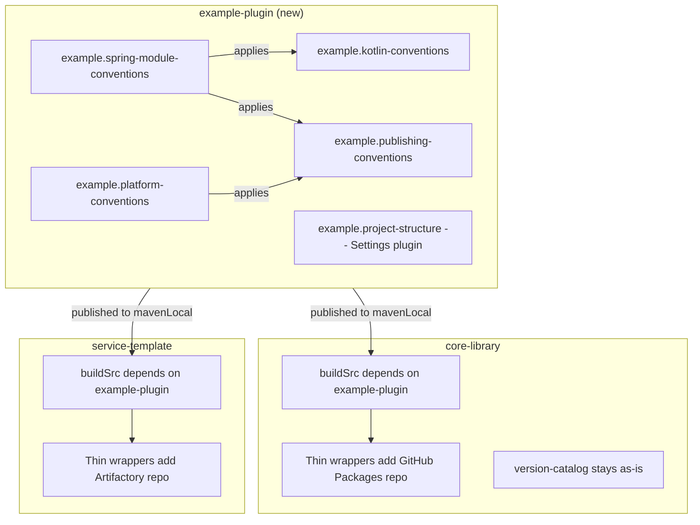

# Implement Shared Gradle Plugin

## Context

Both `core-library` and `service-template` duplicate significant Gradle configuration in their `buildSrc` convention plugins: Kotlin/JVM toolchain setup, Maven publishing scaffolding, Spring module composition, and the 6-module project structure (api, client, persistence, service, web, application). Extracting these into a shared plugin eliminates duplication while keeping the version catalog in `core-library` as the single source of truth for transitive dependency versions.

## Plugin Architecture




## 1. Plugin Project Structure

Create `./example-plugin/` with the following layout:

```
example-plugin/
  build.gradle.kts
  settings.gradle.kts
  gradle.properties
  gradle/
    wrapper/
      gradle-wrapper.properties
  src/main/kotlin/
    example.kotlin-conventions.gradle.kts
    example.publishing-conventions.gradle.kts
    example.spring-module-conventions.gradle.kts
    example.platform-conventions.gradle.kts
    example.project-structure.settings.gradle.kts
```

## 2. Plugin Build Configuration

`**example-plugin/build.gradle.kts**` -- apply `kotlin-dsl` (which includes `java-gradle-plugin` for plugin marker artifacts) and `maven-publish` for publishing:

```kotlin
plugins {
    `kotlin-dsl`
    `maven-publish`
}

group = "com.example.gradle"
version = "0.0.1-SNAPSHOT"

repositories {
    gradlePluginPortal()
    mavenCentral()
}

dependencies {
    implementation("org.jetbrains.kotlin:kotlin-gradle-plugin:2.3.10")
}

publishing {
    repositories {
        mavenLocal()
    }
}
```

`**example-plugin/settings.gradle.kts**` -- minimal:

```kotlin
rootProject.name = "example-plugin"
```

`**example-plugin/gradle.properties**`:

```properties
group=com.example.gradle
version=0.0.1-SNAPSHOT
```

**Gradle wrapper**: same version (9.3.1) as both projects.

## 3. Convention Plugins -- Contents

### 3a. `example.kotlin-conventions.gradle.kts`

Extracts the common Kotlin/JVM setup from both projects. Does NOT include publishing (following the more modular service-template pattern):

```kotlin
plugins {
    id("org.jetbrains.kotlin.jvm")
}

group = property("group") as String
version = property("version") as String

repositories {
    mavenCentral()
    mavenLocal()
}

java {
    toolchain {
        languageVersion.set(JavaLanguageVersion.of(25))
    }
}

kotlin {
    compilerOptions {
        jvmTarget.set(org.jetbrains.kotlin.gradle.dsl.JvmTarget.JVM_25)
    }
}
```

### 3b. `example.publishing-conventions.gradle.kts`

Base Maven publishing setup shared by both projects. Supports both `javaPlatform` and `java` components (from core-library's pattern). Publishes to mavenLocal only; project-specific remote repos are added by consuming projects:

```kotlin
plugins {
    `maven-publish`
}

publishing {
    publications {
        create<MavenPublication>("maven") {
            afterEvaluate {
                val component = components.findByName("javaPlatform")
                    ?: components.findByName("java")
                component?.let { from(it) }
            }
            pom {
                name.set(project.name)
                description.set("${project.group} module: ${project.name}")
            }
        }
    }
    repositories {
        mavenLocal()
    }
}
```

### 3c. `example.spring-module-conventions.gradle.kts`

Composes kotlin + publishing (common to both projects' spring-module convention):

```kotlin
plugins {
    id("example.kotlin-conventions")
    id("example.publishing-conventions")
}
```

### 3d. `example.platform-conventions.gradle.kts`

Java platform + publishing (used by core-library's `spring-core-platform` module):

```kotlin
plugins {
    id("java-platform")
    id("example.publishing-conventions")
}

group = property("group") as String
version = property("version") as String

repositories {
    mavenCentral()
    mavenLocal()
}
```

### 3e. `example.project-structure.settings.gradle.kts` (Settings Plugin)

Auto-includes the 6 common modules that both projects share:

```kotlin
include("api")
include("client")
include("persistence")
include("service")
include("web")
include("application")
```

This is optional -- projects can still include modules manually if they need a different structure (e.g., core-library with its extra modules).

## 4. Adapting core-library

After publishing `example-plugin` to mavenLocal, core-library's `buildSrc` depends on it. The `kotlin-gradle-plugin` is no longer declared explicitly -- it arrives as a transitive dependency of `example-plugin`. The version catalog reference in buildSrc is removed entirely.

- **[core-library/buildSrc/settings.gradle.kts](core-library/buildSrc/settings.gradle.kts)** -- remove the `dependencyResolutionManagement` / `versionCatalogs` block (no longer needed):

```kotlin
// empty or removed -- no version catalog needed in buildSrc
```

- **[core-library/buildSrc/build.gradle.kts](core-library/buildSrc/build.gradle.kts)** -- only the plugin dependency remains:

```kotlin
plugins {
    `kotlin-dsl`
}

repositories {
    gradlePluginPortal()
    mavenCentral()
    mavenLocal()
}

dependencies {
    implementation("com.example.gradle:example-plugin:0.0.1-SNAPSHOT")
}
```

- `**core-library.kotlin-conventions**` -- simplify to apply shared plugin + publishing:

```kotlin
plugins {
    id("example.kotlin-conventions")
    id("example.publishing-conventions")
}
```

The GitHub Packages repository is added via a separate project-specific wrapper or an `allprojects` block in the root `build.gradle.kts`.

- `**core-library.publishing-conventions**` -- reduced to only the GitHub Packages remote repo config (extending what the shared plugin already sets up).
- `**core-library.platform-conventions**` -- replaced by `example.platform-conventions` (plus GitHub Packages if needed).
- `**core-library.spring-module-conventions**` -- replaced by `example.spring-module-conventions` or `core-library.kotlin-conventions`.
- **Subproject build files**: no changes required if wrapper convention names are kept.
- **version-catalog subproject**: unchanged -- core-library remains the source of truth for transitive dependency versions.

## 5. Adapting service-template

The same simplification applies. The `kotlin-gradle-plugin` comes transitively from `example-plugin`, and the local `gradle/libs.versions.toml` (which only declared the Kotlin version) can be deleted.

- **[service-template/buildSrc/settings.gradle.kts](service-template/buildSrc/settings.gradle.kts)** -- remove the `dependencyResolutionManagement` / `versionCatalogs` block:

```kotlin
// empty or removed -- no version catalog needed in buildSrc
```

- **[service-template/buildSrc/build.gradle.kts](service-template/buildSrc/build.gradle.kts)** -- only the plugin dependency remains:

```kotlin
plugins {
    `kotlin-dsl`
}

repositories {
    gradlePluginPortal()
    mavenCentral()
    mavenLocal()
}

dependencies {
    implementation("com.example.gradle:example-plugin:0.0.1-SNAPSHOT")
}
```

- **Delete [service-template/gradle/libs.versions.toml**](service-template/gradle/libs.versions.toml) -- it only contained the Kotlin version, which is now provided transitively by `example-plugin`. No longer needed.
- **Convention plugins** simplify the same way as core-library; the Artifactory repo is added project-specifically.
- **[service-template/settings.gradle.kts](service-template/settings.gradle.kts)** -- optionally apply the settings plugin to auto-include the 6 modules (removing manual `include()` calls), while keeping the `coreLibs` version catalog resolution.
- **Subproject build files**: no changes required if wrapper convention names are kept.

## 6. Build and Publish Order

1. Build and publish `example-plugin` to mavenLocal: `./gradlew publishToMavenLocal` in `example-plugin/`
2. Build and publish `core-library` (including version-catalog) to mavenLocal
3. Build `service-template`

## Key Design Decisions

- **Kotlin version is pinned in the plugin** (2.3.10) as a compile-time dependency of the convention plugins. Upgrading Kotlin means publishing a new plugin version. Both projects' buildSrc files rely on this transitive dependency -- no explicit `kotlin-gradle-plugin` declaration or version catalog reference in buildSrc.
- **Publishing repos are NOT in the shared plugin** -- only mavenLocal is included. GitHub Packages and Artifactory are project-specific concerns.
- **Version catalog stays in core-library** -- the plugin manages build conventions only, not dependency versions.
- **The settings plugin is opt-in** -- projects with non-standard module layouts (like core-library with 14 modules) can skip it and include modules manually.
- **service-template's local `gradle/libs.versions.toml` is deleted** -- it only existed for the Kotlin version, which is now supplied transitively by `example-plugin`.

