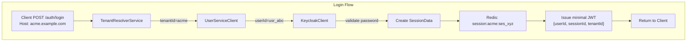
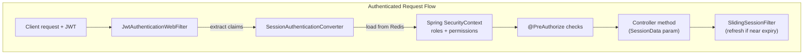
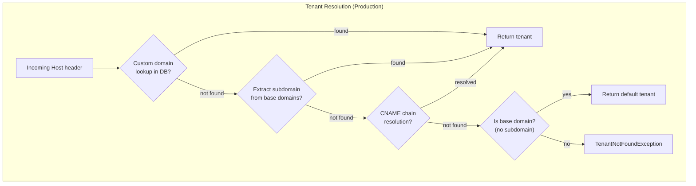

# Multi-Tenant Auth-Service Implementation Plan

## Project Location and Structure

Create `auth-service/` at the workspace root, following the same multi-module pattern as `service-template/`:

```
auth-service/
├── build.gradle.kts              (empty root)
├── settings.gradle.kts           (includes all modules, imports coreLibs catalog)
├── gradle.properties             (group=com.example.auth, coreCatalogVersion, etc.)
├── gradle/
│   └── libs.versions.toml        (local catalog: example-plugin ref + auth-specific deps)
├── buildSrc/
│   ├── settings.gradle.kts       (loads both local libs + coreLibs catalogs)
│   └── build.gradle.kts          (depends on example-plugin)
├── api/                          (DTOs, requests, responses)
├── jwt-api/                      (JWT interfaces: JwtService, JwtTokenProvider)
├── jwt-impl/                     (JJWT-based implementation of jwt-api)
├── persistence/                  (Redis repositories, JPA tenant entities)
├── service/                      (Business logic: auth, session, tenant)
├── web/                          (Controllers, filters, security config)
└── application/                  (Spring Boot entry point)
```

Base package: `com.example.auth`

## Technology Stack

Matching existing projects:

- Kotlin 2.3.10, Java 25, Gradle 9.3.1
- Spring Boot 4.0.2 (WebFlux, reactive)
- Convention plugins from `com.example.gradle:example-plugin`
- Version catalog from `com.example.core:version-catalog`

Auth-specific:

- Spring Boot Starter WebFlux (reactive, suspended controllers)
- Spring Boot Starter Security (WebFlux security)
- Spring Data Redis Reactive (session store)
- JJWT (io.jsonwebtoken) for JWT generation/validation
- Ktor Client for Keycloak/User-Service HTTP calls
- Spring Boot Starter Data R2DBC (for tenant DB queries)
- H2 (local profile)

## Module Breakdown

### 1. `api/` -- DTOs and Domain Models

Key classes in `com.example.auth.api`:

- `AuthToken` -- minimal JWT payload (userId, sessionId, tenantId, issuedAt, expiresAt)
- `SessionData` -- full session from Redis (sessionId, userId, tenantId, username, email, roles, permissions, scopes, keycloakAccessToken, keycloakRefreshToken, createdAt, lastAccessedAt, expiresAt)
- `Tenant` -- domain model (tenantId, name, subdomain, customDomains, isDefault, isActive, createdAt, updatedAt)
- `LoginRequest` / `LoginResponse`
- `LogoutRequest`
- Exception classes: `TenantNotFoundException`, `SessionExpiredException`, `AuthenticationException`

### 2. `jwt-api/` -- JWT Interfaces

Key classes in `com.example.auth.jwt`:

- `JwtService` interface -- generate, validate, refresh, and extract tokens (operates on `AuthToken` from `api`)
- `JwtTokenProvider` interface -- low-level token creation and parsing abstraction
- `JwtProperties` interface -- contract for JWT configuration (secret, issuer, expiration)

This module depends only on `api/` and contains no Spring or implementation dependencies. The concrete implementation lives in `jwt-impl/`.

### 3. `jwt-impl/` -- JWT Implementation

Key classes in `com.example.auth.jwt.impl` (or `com.example.auth.jwt`):

- `JwtServiceImpl` -- JJWT-based implementation of `JwtService` from `jwt-api`
- Implements token generation, validation, refresh, and extraction using io.jsonwebtoken (JJWT)

This module depends on `jwt-api` and `jjwt-*` only. The `service/` module depends on `jwt-api` (interfaces) and receives the implementation at runtime via dependency injection; `application/` (or `web/`) brings `jwt-impl` onto the classpath so Spring can instantiate `JwtServiceImpl`.

### 4. `persistence/` -- Repository Interfaces and Redis/DB Implementation

Key classes in `com.example.auth.persistence`:

**Session storage (Redis):**

- `SessionRepository` interface (save, findById, deleteById, findAllByUserId, deleteAllByUserId, deleteAllByUserIdAndTenantId)
- `RedisSessionRepository` -- Redis implementation with TTL auto-expiration, user session indexes (`session:{tenantId}:{sessionId}`, `user_sessions:{userId}`, `user_tenant_sessions:{userId}:{tenantId}`)

**Tenant storage (R2DBC/JPA):**

- `TenantRepository` interface (findBySubdomain, findByCustomDomain, findDefault, findById)
- `BaseDomainRepository` interface (findAll)
- `TenantResolverCache` -- local in-memory cache for tenant lookups (host-to-tenant mapping, base domains), implemented with Caffeine (not shared in Redis)

**DB schema:** SQL migration files for `tenants`, `tenant_custom_domains`, `base_domains` tables (as specified in the requirements doc).

### 5. `service/` -- Business Logic

Key classes in `com.example.auth.service`:

**Tenant resolution:**

- `TenantResolverService` interface (resolveTenantId, resolveTenant)
- `ProductionTenantResolverService` (`@Profile("!local")`) -- DB-driven: custom domain lookup, subdomain extraction from base domains, CNAME resolution chain, cache layer
- `LocalTenantResolverService` (`@Profile("local")`) -- handles localhost, *.localhost, lvh.me variants via DB lookup
- `DnsResolverService` interface + `ProductionDnsResolverService` (JNDI-based CNAME chain resolution) + `LocalDnsResolverService` (no-op)

**Authentication:**

- `AuthenticationService` -- orchestrates login flow: resolve tenant -> resolve userId from email -> authenticate with Keycloak -> get user roles -> create Redis session -> issue JWT (injects `JwtService` from `jwt-api`, implementation supplied by `jwt-impl` at runtime)
- `SessionInvalidationService` -- logout (single session), logoutFromTenant, logoutFromAllTenants, blacklistToken

**Keycloak client** (package `com.example.auth.service.keycloak`):

- `KeycloakClient` interface (authenticate, refreshTokens, introspect, revokeToken)
- `KeycloakClientImpl` -- Ktor HTTP client calling Keycloak token endpoint with Direct Access Grant (password grant type, noting OAuth 2.1 caveat)
- `KeycloakTokens` data class
- `KeycloakProperties` (`@ConfigurationProperties("auth.keycloak")`) -- serverUrl, realm, clientId, clientSecret

**User Service client** (package `com.example.user.client`) -- will eventually come from a `user-service` client dependency; mocked for now:

- `UserServiceClient` interface (resolveUser, getUserDetails)
- `UserResolveResponse`, `UserDetailsResponse` data classes
- `MockedUserServiceClient` (`@Profile("local", "dev")`) -- hardcoded responses for 3 test users (john, jane, admin) with different roles/permissions/tenantIds

**Configuration:**

- `SessionProperties` (`@ConfigurationProperties("auth.session")`) -- tokenExpirationMinutes, refreshWindowMinutes, sessionTimeoutMinutes, slidingSessionEnabled

### 6. `web/` -- Controllers, Filters, Security

Key classes in `com.example.auth.web`:

**Security configuration:**

- `SecurityConfig` (`@EnableWebFluxSecurity`, `@EnableReactiveMethodSecurity`) -- configures `SecurityWebFilterChain` with permitAll on auth endpoints, authenticated on everything else
- `AuthSecurityExpressions` (`@Component("auth")`) -- SpEL bean with `hasRole`, `hasAnyRole`, `hasAllRoles`, `hasPermission`, `hasAnyPermission`, `hasAllPermissions`, `isTenant`, `isOwner` methods returning `Mono<Boolean>`
- Convenience annotations: `@RequireAdmin`, `@RequireUser`, `@RequireAdminOrModerator`, `@CanReadUsers`, `@CanWriteUsers`, `@CanDeleteUsers`

**Authentication filter:**

- `SessionAuthenticationConverter` -- extracts JWT from Authorization header, loads session from Redis, converts to Spring `Authentication` with roles/permissions as `GrantedAuthority`
- `JwtAuthenticationWebFilter` -- integrates with Spring Security filter chain

**Session resolver:**

- `SessionDataArgumentResolver` -- resolves `SessionData` parameter in controller methods from the `Authentication` principal

**Sliding session filter:**

- `SlidingSessionCoFilter` -- if token nears expiry within the configured window, issues a refreshed token in `X-Refreshed-Token` response header

**Controllers:**

- `AuthController` -- `POST /auth/login`, `POST /auth/logout`, `POST /auth/refresh`
- Example `UserController` demonstrating `@PreAuthorize("@auth.hasRole('ADMIN')")` usage

### 7. `application/` -- Spring Boot Entry Point

- `AuthServiceApplication` (`@SpringBootApplication(scanBasePackages = ["com.example.auth", "com.example.user"])`)
- `application.yaml` -- Redis config, JWT config, Keycloak config, session config
- `application-local.yaml` -- local profile with H2 for tenant DB, embedded Redis or localhost Redis, default Keycloak URL

## Build Configuration

### `gradle/libs.versions.toml`

```toml
[versions]
example-plugin = "0.0.1-SNAPSHOT"
jjwt = "0.12.6"
ktor = "3.1.1"
caffeine = "3.1.8"

[libraries]
example-plugin = { module = "com.example.gradle:example-plugin", version.ref = "example-plugin" }
caffeine = { module = "com.github.ben-manes.caffeine:caffeine", version.ref = "caffeine" }
jjwt-api = { module = "io.jsonwebtoken:jjwt-api", version.ref = "jjwt" }
jjwt-impl = { module = "io.jsonwebtoken:jjwt-impl", version.ref = "jjwt" }
jjwt-jackson = { module = "io.jsonwebtoken:jjwt-jackson", version.ref = "jjwt" }
ktor-client-core = { module = "io.ktor:ktor-client-core", version.ref = "ktor" }
ktor-client-cio = { module = "io.ktor:ktor-client-cio", version.ref = "ktor" }
ktor-client-content-negotiation = { module = "io.ktor:ktor-client-content-negotiation", version.ref = "ktor" }
ktor-serialization-jackson = { module = "io.ktor:ktor-serialization-jackson", version.ref = "ktor" }
```

### Module dependencies summary

- `api` -> `coreLibs.core.platform` (BOM), `coreLibs.core.api`
- `jwt-api` -> `api` (interfaces only, no Spring or JJWT dependencies)
- `jwt-impl` -> `jwt-api`, `jjwt-*` (JJWT-based implementation; no dependency from service)
- `persistence` -> `api`, `spring-boot-starter-data-redis-reactive`, `spring-boot-starter-data-r2dbc`, `caffeine`, `coreLibs.core.persistence`
- `service` -> `api`, `jwt-api`, `persistence`, `ktor-client-*`, `coreLibs.core.service` (uses JwtService interface only)
- `web` -> `service`, `jwt-api`, `spring-boot-starter-security`, `spring-boot-starter-webflux`, `coreLibs.core.web`
- `application` -> `web`, `jwt-impl`, Spring Boot plugin, `spring-boot-starter`, H2/R2DBC drivers (jwt-impl on classpath so JwtServiceImpl bean is available)

## Key Architecture Flows










## Implementation Order

Work proceeds module-by-module, bottom-up from the dependency graph. Each todo produces a working, compilable state.