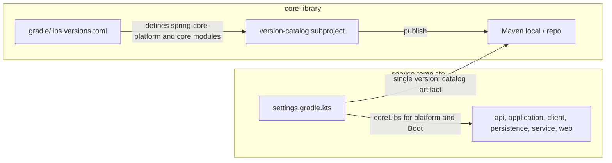

# Publish version catalog from core-library

## Current state

- **core-library** has [core-library/gradle/libs.versions.toml](core-library/gradle/libs.versions.toml) with `spring-boot = "4.0.2"`, Spring Boot plugin, Kotlin, and spring-* libraries. It does not yet define the `spring-core-platform` (or core-library) version or consumer-facing library entries for platform/modules.
- **service-template** has its own [service-template/gradle/libs.versions.toml](service-template/gradle/libs.versions.toml) with `core-library = "0.0.1-SNAPSHOT"`, all core-* library entries (core-platform, core-api, etc.), and the Spring Boot plugin inlined. Builds use `libs.core.platform`, `libs.core.application`, etc. and `libs.plugins.spring.boot`.

## Target state

- core-library publishes a **version catalog** artifact (e.g. `com.example.core:gradle-version-catalog:0.0.1-SNAPSHOT`) built from its `gradle/libs.versions.toml`, which is extended to define the **core-library version** and **consumer library entries** (spring-core-platform and all core modules). One source of truth for Spring Boot and for spring-core-platform versions.
- service-template **only** depends on that version-catalog artifact (one version to configure). It uses `coreLibs` for the Boot plugin and for all core-library dependencies (platform and modules). No `core-library` version or core-* entries remain in service-template’s TOML.

## Implementation

### 1. Add a version-catalog subproject in core-library

- **New subproject**: e.g. `version-catalog` or `gradle-version-catalog` under core-library (sibling to `spring-core-platform`, `spring-core-api`, etc.).
- **Include it** in [core-library/settings.gradle.kts](core-library/settings.gradle.kts): `include("version-catalog")` (or the chosen name).
- **New [core-library/version-catalog/build.gradle.kts**](core-library/version-catalog/build.gradle.kts) (path and name depend on choice above):
  - Apply plugins: `version-catalog` and `maven-publish`.
  - Use the **existing** root TOML so there is no second copy of the catalog content:
    - `catalog { versionCatalog { from(files("../gradle/libs.versions.toml")) } }`
  - Publishing: one `MavenPublication` that uses the `versionCatalog` component: `from(components["versionCatalog"])`.
  - Set `group` and `version` to match the rest of core-library (e.g. `group = rootProject.group`, `version = rootProject.version` from [core-library/gradle.properties](core-library/gradle.properties)).
  - Artifact coordinates will be `com.example.core:<project-name>:0.0.1-SNAPSHOT` (e.g. `com.example.core:version-catalog:0.0.1-SNAPSHOT` or `com.example.core:gradle-version-catalog:0.0.1-SNAPSHOT`).
- **Extend [core-library/gradle/libs.versions.toml**](core-library/gradle/libs.versions.toml) so the published catalog also defines the spring-core-platform (and core-library) version for consumers:
  - In `[versions]`, add `core-library = "0.0.1-SNAPSHOT"` (must match [core-library/gradle.properties](core-library/gradle.properties) `version`; keep in sync on release).
  - In `[libraries]`, add consumer entries: `core-platform`, `core-api`, `core-client`, `core-persistence`, `core-service`, `core-web`, `core-application`, each with `module = "com.example.core:<module-name>"` and `version.ref = "core-library"`. Then the version-catalog artifact is the single source for both Spring Boot and spring-core-platform versions.
- Other core-library modules keep using the default `libs` from the root TOML (no change).

### 2. Publish the catalog

- Ensure the version-catalog project is published together with the rest of core-library (e.g. `publishToMavenLocal` at root publishes all subprojects).
- For **first-time** or **clean** consumption from service-template, run the version-catalog publish first (e.g. `:version-catalog:publishToMavenLocal`) so the artifact exists when service-template’s settings resolve the catalog dependency.

### 3. Consume the catalog in service-template

- ** [service-template/settings.gradle.kts](service-template/settings.gradle.kts)**:
  - Add `dependencyResolutionManagement { repositories { mavenLocal(); mavenCentral(); ... } }` if not already present (so the catalog dependency can be resolved).
  - In the same block, add `versionCatalogs { create("coreLibs") { from("com.example.core:<version-catalog-artifact-name>:<version>") } }`. This is the **only** version service-template configures for core-library; the catalog supplies spring-core-platform and all core module versions. Use the same version as the published catalog (e.g. `0.0.1-SNAPSHOT`). Optionally read it from [service-template/gradle.properties](service-template/gradle.properties).
- ** [service-template/gradle/libs.versions.toml](service-template/gradle/libs.versions.toml)**: Remove the `core-library` version, all `core-*` library entries (core-platform, core-api, core-client, core-persistence, core-service, core-web, core-application), and the `spring-boot` plugin entry. Keep only what is not provided by the catalog (e.g. Kotlin plugin if not moving it to coreLibs).
- **Switch all modules to `coreLibs` for core-library and Boot plugin:** application: `alias(coreLibs.plugins.spring.boot)`, `platform(coreLibs.core.platform)`, `coreLibs.core.application`; api/client/persistence/service/web: `platform(coreLibs.core.platform)` and the corresponding `coreLibs.core.<module>`.

Optional: use `coreLibs` for Kotlin version/plugin as well and remove those from service-template’s TOML.

### 4. Version alignment (optional)

- service-template only configures the version-catalog artifact version (e.g. in settings or via `gradle.properties`). All spring-core-platform and core module versions come from the catalog, so there is no duplicate version to keep in sync.

## Build order note

- service-template’s `settings.gradle.kts` resolves the version catalog **dependency** when the build starts. So the version-catalog artifact must already be published (e.g. to mavenLocal) before building service-template. Normal workflow: build and publish core-library (including `:version-catalog:publishToMavenLocal`) first, then build service-template.

## Summary

| Area                                                                           | Action                                                                                                                                              |
| ------------------------------------------------------------------------------ | --------------------------------------------------------------------------------------------------------------------------------------------------- |
| core-library libs.versions.toml                                                | Add `core-library` version and consumer library entries (core-platform, core-api, etc.) so the catalog defines spring-core-platform version.        |
| core-library                                                                   | New subproject that applies `version-catalog` + `maven-publish`, publishes root `gradle/libs.versions.toml` as a version catalog artifact.          |
| service-template settings                                                      | Resolve catalog from `com.example.core:<artifact>:<version>` (only version to configure); expose as `coreLibs`.                                     |
| service-template libs.versions.toml                                            | Remove `core-library` version, all core-* entries, and Spring Boot plugin entry.                                                                    |
| service-template modules (api, application, client, persistence, service, web) | Use `coreLibs.core.platform`, `coreLibs.core.<module>`, and `coreLibs.plugins.spring.boot` instead of `libs.core.*` and `libs.plugins.spring.boot`. |

After this, the Spring Boot version and the spring-core-platform (and core-library) version are configured in one place: [core-library/gradle/libs.versions.toml](core-library/gradle/libs.versions.toml). service-template only specifies the version-catalog artifact version; bumping core-library and republishing the version-catalog makes service-template pick up new platform and Boot versions on the next build.