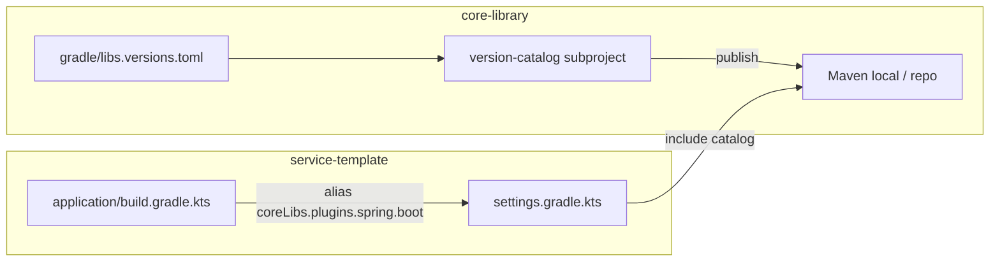

# Publish version catalog from core-library

## Current state

- **core-library** has a single source of truth: [core-library/gradle/libs.versions.toml](core-library/gradle/libs.versions.toml) with `spring-boot = "4.0.2"`, Spring Boot plugin, Kotlin, and spring-* libraries. Subprojects and buildSrc use it via the default `libs` catalog.
- **service-template** has its own [service-template/gradle/libs.versions.toml](service-template/gradle/libs.versions.toml) with the Spring Boot plugin version inlined (`version = "4.0.2"`) and core-library BOM/modules. The Boot plugin is applied in [service-template/application/build.gradle.kts](service-template/application/build.gradle.kts) via `alias(libs.plugins.spring.boot)`.

## Target state

- core-library publishes a **version catalog** artifact (e.g. `com.example.core:gradle-version-catalog:0.0.1-SNAPSHOT`) built from the same `gradle/libs.versions.toml`, so no duplication inside core-library.
- service-template **includes** that catalog (e.g. as `coreLibs`) and uses it for the Spring Boot plugin (and optionally Kotlin). Spring Boot version is then controlled only from core-library’s TOML.

## Implementation

### 1. Add a version-catalog subproject in core-library

- **New subproject**: e.g. `version-catalog` or `gradle-version-catalog` under core-library (sibling to `spring-core-platform`, `spring-core-api`, etc.).
- **Include it** in [core-library/settings.gradle.kts](core-library/settings.gradle.kts): `include("version-catalog")` (or the chosen name).
- **New [core-library/version-catalog/build.gradle.kts**](core-library/version-catalog/build.gradle.kts) (path and name depend on choice above):
  - Apply plugins: `version-catalog` and `maven-publish`.
  - Use the **existing** root TOML so there is no second copy of the catalog content:
    - `catalog { versionCatalog { from(files("../gradle/libs.versions.toml")) } }`
  - Publishing: one `MavenPublication` that uses the `versionCatalog` component: `from(components["versionCatalog"])`.
  - Set `group` and `version` to match the rest of core-library (e.g. `group = rootProject.group`, `version = rootProject.version` from [core-library/gradle.properties](core-library/gradle.properties)).
  - Artifact coordinates will be `com.example.core:<project-name>:0.0.1-SNAPSHOT` (e.g. `com.example.core:version-catalog:0.0.1-SNAPSHOT` or `com.example.core:gradle-version-catalog:0.0.1-SNAPSHOT`).

No changes to [core-library/gradle/libs.versions.toml](core-library/gradle/libs.versions.toml) or to other core-library modules; they keep using the default `libs` from the root TOML.

### 2. Publish the catalog

- Ensure the version-catalog project is published together with the rest of core-library (e.g. `publishToMavenLocal` at root publishes all subprojects).
- For **first-time** or **clean** consumption from service-template, run the version-catalog publish first (e.g. `:version-catalog:publishToMavenLocal`) so the artifact exists when service-template’s settings resolve the catalog dependency.

### 3. Consume the catalog in service-template

- ** [service-template/settings.gradle.kts](service-template/settings.gradle.kts)**:
  - Add `dependencyResolutionManagement { repositories { mavenLocal(); mavenCentral(); ... } }` if not already present (so the catalog dependency can be resolved).
  - In the same block, add `versionCatalogs { create("coreLibs") { from("com.example.core:<version-catalog-artifact-name>:<version>") } }`. Use the same version as core-library (e.g. `0.0.1-SNAPSHOT`). Optionally read the version from a property (e.g. `gradle.properties`) to avoid hardcoding in two places.
- ** [service-template/gradle/libs.versions.toml](service-template/gradle/libs.versions.toml)**: Remove the `spring-boot` plugin entry (the one with `id = "org.springframework.boot"` and `version = "4.0.2"`).
- ** [service-template/application/build.gradle.kts](service-template/application/build.gradle.kts)**: Replace `alias(libs.plugins.spring.boot)` with `alias(coreLibs.plugins.spring.boot)`.

Optional: if service-template should also use the shared catalog for Kotlin or other versions, migrate those entries to use `coreLibs` in the same way (and remove duplicates from service-template’s TOML).

### 4. Version alignment (optional)

- To avoid duplicating the core-library version in both settings (catalog dependency) and `libs.versions.toml` (core-* libraries), service-template can define e.g. `coreLibraryVersion` in [service-template/gradle.properties](service-template/gradle.properties) and use it in `settings.gradle.kts` for the catalog dependency: `from("com.example.core:gradle-version-catalog:${gradle.properties["coreLibraryVersion"]}")`. The BOM/core-* version in libs.versions.toml would still need to stay in sync manually or via a single property used in build scripts.

## Build order note

- service-template’s `settings.gradle.kts` resolves the version catalog **dependency** when the build starts. So the version-catalog artifact must already be published (e.g. to mavenLocal) before building service-template. Normal workflow: build and publish core-library (including `:version-catalog:publishToMavenLocal`) first, then build service-template.

## Summary

| Area                                | Action                                                                                                                                     |
| ----------------------------------- | ------------------------------------------------------------------------------------------------------------------------------------------ |
| core-library                        | New subproject that applies `version-catalog` + `maven-publish`, publishes root `gradle/libs.versions.toml` as a version catalog artifact. |
| service-template settings           | Resolve catalog from `com.example.core:<artifact>:<version>`; expose it as `coreLibs`.                                                     |
| service-template libs.versions.toml | Remove Spring Boot plugin entry.                                                                                                           |
| service-template application        | Use `coreLibs.plugins.spring.boot` instead of `libs.plugins.spring.boot`.                                                                  |

After this, the Spring Boot version is configured in one place: [core-library/gradle/libs.versions.toml](core-library/gradle/libs.versions.toml). Bumping it there and republishing the version-catalog (and core-library) will make service-template pick it up on the next build (and after refreshing the catalog dependency if needed).