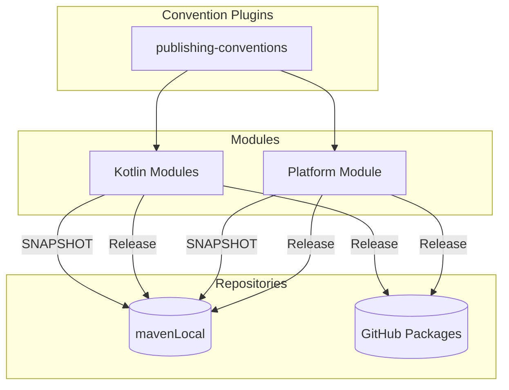

# Publishing Convention Plugin Plan

## Current State

- Multi-module Gradle project with 15 modules in `core-library/`
- Convention plugins located in `buildSrc/src/main/kotlin/`
- Current version: `0.0.1-SNAPSHOT` (in `gradle.properties`)
- Group: `com.example.core`
- No existing publishing configuration

## Architecture




## Implementation Steps

### 1. Create Unified Publishing Convention Plugin

Create `[buildSrc/src/main/kotlin/core-library.publishing-conventions.gradle.kts](core-library/buildSrc/src/main/kotlin/core-library.publishing-conventions.gradle.kts)`:

```kotlin
plugins {
    `maven-publish`
}

publishing {
    publications {
        create<MavenPublication>("maven") {
            // Defer configuration until components are available
            afterEvaluate {
                // Auto-detect: use javaPlatform component if available, otherwise java
                val component = components.findByName("javaPlatform")
                    ?: components.findByName("java")
                
                component?.let { from(it) }
            }
            
            pom {
                name.set(project.name)
                description.set("Core library module: ${project.name}")
            }
        }
    }
    
    repositories {
        mavenLocal()
        
        // Only add GitHub Packages for non-SNAPSHOT versions
        if (!version.toString().endsWith("-SNAPSHOT")) {
            maven {
                name = "GitHubPackages"
                url = uri(property("github.packages.url") as String)
                credentials {
                    username = System.getenv("GITHUB_ACTOR") ?: findProperty("gpr.user") as String?
                    password = System.getenv("GITHUB_TOKEN") ?: findProperty("gpr.key") as String?
                }
            }
        }
    }
}
```

**Key design decisions:**

- Uses `afterEvaluate` to defer component resolution until other plugins have registered their components
- Auto-detects whether the project is a `java-platform` or regular `java`/`kotlin` module using `components.findByName()`
- Single plugin works for all module types

### 2. Apply Publishing Convention to Kotlin Modules

Update `[buildSrc/src/main/kotlin/core-library.kotlin-conventions.gradle.kts](core-library/buildSrc/src/main/kotlin/core-library.kotlin-conventions.gradle.kts)`:

```kotlin
plugins {
    id("org.jetbrains.kotlin.jvm")
    id("core-library.publishing-conventions")  // Add this line
}
// ... rest unchanged
```

### 3. Apply Publishing Convention to Platform Module

Update `[buildSrc/src/main/kotlin/core-library.platform-conventions.gradle.kts](core-library/buildSrc/src/main/kotlin/core-library.platform-conventions.gradle.kts)`:

```kotlin
plugins {
    id("java-platform")
    id("core-library.publishing-conventions")  // Add this line (same plugin!)
}
// ... rest unchanged
```

### 4. Configure GitHub Repository URL

Add to `[gradle.properties](core-library/gradle.properties)`:

```properties
github.packages.url=https://maven.pkg.github.com/your-org/core-library
```

## Authentication Setup

GitHub Packages requires authentication. Two supported methods:

1. **Environment Variables** (recommended for CI/CD):
  - `GITHUB_ACTOR` - GitHub username
  - `GITHUB_TOKEN` - Personal access token with `write:packages` scope
2. **Gradle Properties** (for local development):
  Add to `~/.gradle/gradle.properties`:

## Usage

After implementation:

```bash
# Publish SNAPSHOT to mavenLocal only
./gradlew publishToMavenLocal

# Publish release to both (after changing version in gradle.properties to remove -SNAPSHOT)
./gradlew publish
```

The `publish` task will:

- For SNAPSHOT versions: Only publish to mavenLocal
- For release versions: Publish to both mavenLocal and GitHub Packages

## Files to Create/Modify

- `buildSrc/src/main/kotlin/core-library.publishing-conventions.gradle.kts` - **Create** (unified plugin)
- `buildSrc/src/main/kotlin/core-library.kotlin-conventions.gradle.kts` - **Modify** (add plugin apply)
- `buildSrc/src/main/kotlin/core-library.platform-conventions.gradle.kts` - **Modify** (add plugin apply)
- `gradle.properties` - **Modify** (add GitHub URL)

