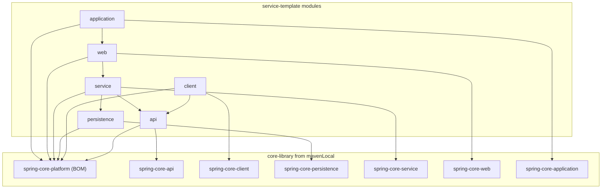

# Service Template Skeleton Plan

## Context

The `core-library` is a multi-module Gradle project with:

- **Framework-agnostic modules**: `core-api`, `core-client`, `core-persistence`, `core-service`, `core-web`, `core-application`
- **Spring modules**: `spring-core-platform` (BOM), `spring-core-api`, `spring-core-client`, `spring-core-persistence`, `spring-core-service`, `spring-core-web`, `spring-core-application`
- **Versions**: Gradle 9.3.1, Kotlin 2.3.10, Java 25, Spring Boot 4.0.2
- **Group**: `com.example.core`, published to mavenLocal

The `service-template` will be an independent Gradle project at `./service-template/` that **consumes** the core-library artifacts and provides concrete Spring implementations.

## Target Directory Structure

```
service-template/
  settings.gradle.kts
  build.gradle.kts
  gradle.properties
  gradlew / gradlew.bat
  gradle/
    libs.versions.toml
    wrapper/
      gradle-wrapper.jar
      gradle-wrapper.properties
  buildSrc/
    build.gradle.kts
    settings.gradle.kts
    src/main/kotlin/
      service-template.kotlin-conventions.gradle.kts
      service-template.spring-module-conventions.gradle.kts
  api/
    build.gradle.kts
    src/main/kotlin/com/example/service/api/
  client/
    build.gradle.kts
    src/main/kotlin/com/example/service/client/
  persistence/
    build.gradle.kts
    src/main/kotlin/com/example/service/persistence/
  service/
    build.gradle.kts
    src/main/kotlin/com/example/service/service/
  web/
    build.gradle.kts
    src/main/kotlin/com/example/service/web/
  application/
    build.gradle.kts
    src/main/kotlin/com/example/service/application/
    src/main/resources/application.yml
```

## Key Design Decisions

### 1. No platform module

The service-template does **not** create its own platform/BOM artifact. Instead, all modules reference `com.example.core:spring-core-platform` from mavenLocal for dependency version management.

### 2. Publishing conventions (library modules only)

All modules **except** `application` are published as library artifacts (to mavenLocal and later to an Artifactory). The `application` module is the deployable service -- it does **not** publish a JAR. Instead, it uses Spring Boot's `bootBuildImage` Gradle task to generate a Docker image.

Convention plugins:

- `service-template.publishing-conventions.gradle.kts` -- adapted from core-library's publishing conventions, applied by all library modules.
- The `application` module does NOT apply publishing conventions.

### 3. Module naming

Modules use short names (`api`, `persistence`, `service`, `web`, `application`, `client`) without the `core-` or `spring-core-` prefix, as requested.

### 4. Dependency strategy

Each module depends on:

- The `spring-core-platform` BOM from core-library (version management)
- The corresponding `spring-core-*` module from core-library (API/interfaces)
- Sibling modules within service-template (inter-module dependencies)

## Files to Create

### Root build files

`**service-template/settings.gradle.kts**`

```kotlin
rootProject.name = "service-template"

include("api")
include("client")
include("persistence")
include("service")
include("web")
include("application")
```

`**service-template/build.gradle.kts**` -- empty root, convention plugins in buildSrc.

`**service-template/gradle.properties**`

```properties
group=com.example.service
version=0.0.1-SNAPSHOT
```

### Version catalog: `service-template/gradle/libs.versions.toml`

```toml
[versions]
kotlin = "2.3.10"
core-library = "0.0.1-SNAPSHOT"

[libraries]
# core-library platform BOM (manages all Spring + transitive versions)
core-platform = { module = "com.example.core:spring-core-platform", version.ref = "core-library" }

# core-library Spring modules (versions managed by the platform BOM above)
core-api = { module = "com.example.core:spring-core-api" }
core-client = { module = "com.example.core:spring-core-client" }
core-persistence = { module = "com.example.core:spring-core-persistence" }
core-service = { module = "com.example.core:spring-core-service" }
core-web = { module = "com.example.core:spring-core-web" }
core-application = { module = "com.example.core:spring-core-application" }

# Spring Boot starters (versions managed by the platform BOM)
spring-boot-starter = { module = "org.springframework.boot:spring-boot-starter" }
spring-boot-starter-web = { module = "org.springframework.boot:spring-boot-starter-web" }
spring-boot-starter-webflux = { module = "org.springframework.boot:spring-boot-starter-webflux" }
spring-boot-starter-validation = { module = "org.springframework.boot:spring-boot-starter-validation" }
spring-boot-starter-data-jpa = { module = "org.springframework.boot:spring-boot-starter-data-jpa" }

[plugins]
kotlin-jvm = { id = "org.jetbrains.kotlin.jvm", version.ref = "kotlin" }
spring-boot = { id = "org.springframework.boot", version = "4.0.2" }
```

Key points:

- **No `spring-boot` version variable** -- the Spring Boot plugin version is inlined in `[plugins]`; all Spring library versions are managed transitively by `spring-core-platform` BOM so no Spring version entry is needed in `[versions]`.
- `**core-library` version** is defined in the catalog (not in `gradle.properties`), used only for the platform BOM reference which carries the version. All other core-library module references are version-less (resolved via the BOM).
- **Kotlin version** is in the catalog for the Kotlin Gradle plugin.

### Gradle wrapper

Copy from `core-library/gradle/wrapper/` (Gradle 9.3.1) plus `gradlew` and `gradlew.bat`.

### Convention plugins (buildSrc)

`**service-template/buildSrc/settings.gradle.kts**` -- references `../gradle/libs.versions.toml` (same pattern as [core-library buildSrc](core-library/buildSrc/settings.gradle.kts)).

`**service-template/buildSrc/build.gradle.kts**` -- `kotlin-dsl` plugin + Kotlin Gradle plugin dependency (same pattern as [core-library buildSrc](core-library/buildSrc/build.gradle.kts)).

`**service-template.kotlin-conventions.gradle.kts**` -- based on [core-library.kotlin-conventions.gradle.kts](core-library/buildSrc/src/main/kotlin/core-library.kotlin-conventions.gradle.kts):

- Applies `org.jetbrains.kotlin.jvm`
- Sets Java 25 toolchain and Kotlin JVM 25 target
- Adds `mavenCentral()` + `mavenLocal()` repositories

`**service-template.publishing-conventions.gradle.kts**` -- adapted from [core-library.publishing-conventions.gradle.kts](core-library/buildSrc/src/main/kotlin/core-library.publishing-conventions.gradle.kts):

- Applies `maven-publish`
- Publishes to mavenLocal (and later to a configurable Artifactory)
- Applied by all library modules (api, client, persistence, service, web) but **not** by the application module

`**service-template.spring-module-conventions.gradle.kts**` -- applies both `service-template.kotlin-conventions` and `service-template.publishing-conventions`. This is the standard convention for all publishable library modules.

### Sub-module build files

All library modules use `service-template.spring-module-conventions` (which includes publishing). Each references the platform BOM via the version catalog:

`**api/build.gradle.kts**`

```kotlin
plugins {
    id("service-template.spring-module-conventions")
}
dependencies {
    api(platform(libs.core.platform))
    api(libs.core.api)
    implementation(libs.spring.boot.starter.validation)
}
```

`**client/build.gradle.kts**` -- depends on `libs.core.client`, `:api`, `libs.spring.boot.starter.webflux`

`**persistence/build.gradle.kts**` -- depends on `libs.core.persistence`, `libs.spring.boot.starter.data.jpa`

`**service/build.gradle.kts**` -- depends on `libs.core.service`, `:api`, `:persistence`, `libs.spring.boot.starter`

`**web/build.gradle.kts**` -- depends on `libs.core.web`, `:service`, `libs.spring.boot.starter.web`

`**application/build.gradle.kts**` -- special: applies only `service-template.kotlin-conventions` (no publishing) plus the `spring-boot` plugin. Depends on `libs.core.application`, `:web`, `libs.spring.boot.starter`. `bootJar` stays **enabled**, `jar` is disabled. Configures `bootBuildImage` for Docker image generation:

```kotlin
plugins {
    id("service-template.kotlin-conventions")
    alias(libs.plugins.spring.boot)
}
dependencies {
    api(platform(libs.core.platform))
    api(libs.core.application)
    api(project(":web"))
    implementation(libs.spring.boot.starter)
}
tasks.named<Jar>("jar") { enabled = false }
tasks.named<org.springframework.boot.gradle.tasks.bundling.BootBuildImage>("bootBuildImage") {
    imageName.set("${project.group}/${rootProject.name}")
}
```

### Skeleton source files

Minimal placeholder Kotlin files in each module under `com.example.service.<module>`:

- `api/` -- placeholder data class or marker file
- `client/` -- placeholder
- `persistence/` -- placeholder
- `service/` -- placeholder
- `web/` -- placeholder
- `application/` -- Spring Boot `@SpringBootApplication` main class + `application.yml`

## Dependency Graph




