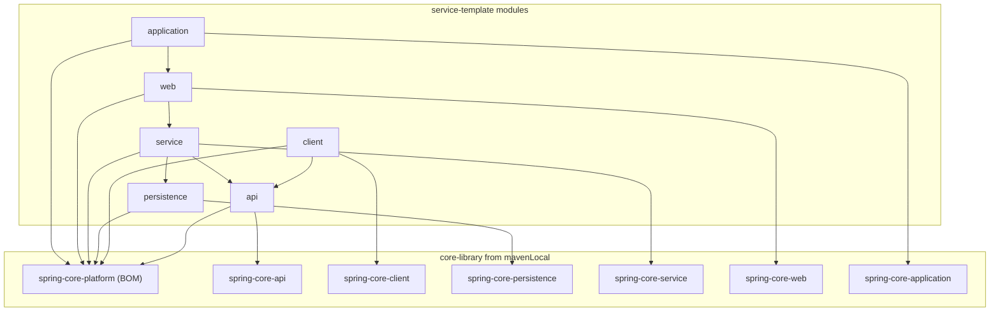

# Service Template Skeleton Plan

## Context

The `core-library` is a multi-module Gradle project with:

- **Framework-agnostic modules**: `core-api`, `core-client`, `core-persistence`, `core-service`, `core-web`, `core-application`
- **Spring modules**: `spring-core-platform` (BOM), `spring-core-api`, `spring-core-client`, `spring-core-persistence`, `spring-core-service`, `spring-core-web`, `spring-core-application`
- **Versions**: Gradle 9.3.1, Kotlin 2.3.10, Java 25, Spring Boot 4.0.2
- **Group**: `com.example.core`, published to mavenLocal

The `service-template` will be an independent Gradle project at `./service-template/` that **consumes** the core-library artifacts and provides concrete Spring implementations.

## Target Directory Structure

```
service-template/
  settings.gradle.kts
  build.gradle.kts
  gradle.properties
  gradlew / gradlew.bat
  gradle/
    libs.versions.toml
    wrapper/
      gradle-wrapper.jar
      gradle-wrapper.properties
  buildSrc/
    build.gradle.kts
    settings.gradle.kts
    src/main/kotlin/
      service-template.kotlin-conventions.gradle.kts
      service-template.spring-module-conventions.gradle.kts
  api/
    build.gradle.kts
    src/main/kotlin/com/example/service/api/
  client/
    build.gradle.kts
    src/main/kotlin/com/example/service/client/
  persistence/
    build.gradle.kts
    src/main/kotlin/com/example/service/persistence/
  service/
    build.gradle.kts
    src/main/kotlin/com/example/service/service/
  web/
    build.gradle.kts
    src/main/kotlin/com/example/service/web/
  application/
    build.gradle.kts
    src/main/kotlin/com/example/service/application/
    src/main/resources/application.yml
```

## Key Design Decisions

### 1. No platform module

The service-template does **not** create its own platform/BOM artifact. Instead, all modules reference `com.example.core:spring-core-platform` from mavenLocal for dependency version management.

### 2. No publishing conventions

Unlike the core-library, the service-template is an application -- it does not publish library artifacts. No `maven-publish` plugin or publishing conventions are needed.

### 3. Module naming

Modules use short names (`api`, `persistence`, `service`, `web`, `application`, `client`) without the `core-` or `spring-core-` prefix, as requested.

### 4. Dependency strategy

Each module depends on:

- The `spring-core-platform` BOM from core-library (version management)
- The corresponding `spring-core-*` module from core-library (API/interfaces)
- Sibling modules within service-template (inter-module dependencies)

## Files to Create

### Root build files

`**service-template/settings.gradle.kts**`

```kotlin
rootProject.name = "service-template"

include("api")
include("client")
include("persistence")
include("service")
include("web")
include("application")
```

`**service-template/build.gradle.kts**` -- empty root, convention plugins in buildSrc.

`**service-template/gradle.properties**`

```properties
group=com.example.service
version=0.0.1-SNAPSHOT
coreLibraryVersion=0.0.1-SNAPSHOT
```

### Version catalog: `service-template/gradle/libs.versions.toml`

Mirrors `core-library` versions:

- `spring-boot = "4.0.2"`, `kotlin = "2.3.10"`
- Libraries: Spring Boot starters (same as core-library) + core-library modules referenced as external dependencies (`com.example.core:spring-core-api`, etc.)
- Plugins: `kotlin-jvm`, `spring-boot`

### Gradle wrapper

Copy from `core-library/gradle/wrapper/` (Gradle 9.3.1) plus `gradlew` and `gradlew.bat`.

### Convention plugins (buildSrc)

`**service-template/buildSrc/settings.gradle.kts**` -- references `../gradle/libs.versions.toml` (same pattern as [core-library buildSrc](core-library/buildSrc/settings.gradle.kts)).

`**service-template/buildSrc/build.gradle.kts**` -- `kotlin-dsl` plugin + Kotlin Gradle plugin dependency (same pattern as [core-library buildSrc](core-library/buildSrc/build.gradle.kts)).

`**service-template.kotlin-conventions.gradle.kts**` -- based on [core-library.kotlin-conventions.gradle.kts](core-library/buildSrc/src/main/kotlin/core-library.kotlin-conventions.gradle.kts) but:

- Applies `org.jetbrains.kotlin.jvm`
- Sets Java 25 toolchain and Kotlin JVM 25 target
- Adds `mavenCentral()` + `mavenLocal()` repositories
- **No** publishing conventions

`**service-template.spring-module-conventions.gradle.kts**` -- applies `service-template.kotlin-conventions` (mirrors [core-library.spring-module-conventions.gradle.kts](core-library/buildSrc/src/main/kotlin/core-library.spring-module-conventions.gradle.kts)).

### Sub-module build files

Each module follows this pattern:

`**api/build.gradle.kts**`

```kotlin
plugins {
    id("service-template.spring-module-conventions")
}
dependencies {
    api(platform("com.example.core:spring-core-platform:${property("coreLibraryVersion")}"))
    api("com.example.core:spring-core-api")
    implementation(libs.spring.boot.starter.validation)
}
```

`**client/build.gradle.kts**` -- depends on `spring-core-client`, `:api`, `spring-boot-starter-webflux`

`**persistence/build.gradle.kts**` -- depends on `spring-core-persistence`, `spring-boot-starter-data-jpa`

`**service/build.gradle.kts**` -- depends on `spring-core-service`, `:api`, `:persistence`, `spring-boot-starter`

`**web/build.gradle.kts**` -- depends on `spring-core-web`, `:service`, `spring-boot-starter-web`

`**application/build.gradle.kts**` -- applies `spring-boot` plugin, depends on `spring-core-application`, `:web`, `spring-boot-starter`. Unlike core-library, `bootJar` stays **enabled** (this is an executable service).

### Skeleton source files

Minimal placeholder Kotlin files in each module under `com.example.service.<module>`:

- `api/` -- placeholder data class or marker file
- `client/` -- placeholder
- `persistence/` -- placeholder
- `service/` -- placeholder
- `web/` -- placeholder
- `application/` -- Spring Boot `@SpringBootApplication` main class + `application.yml`

## Dependency Graph




