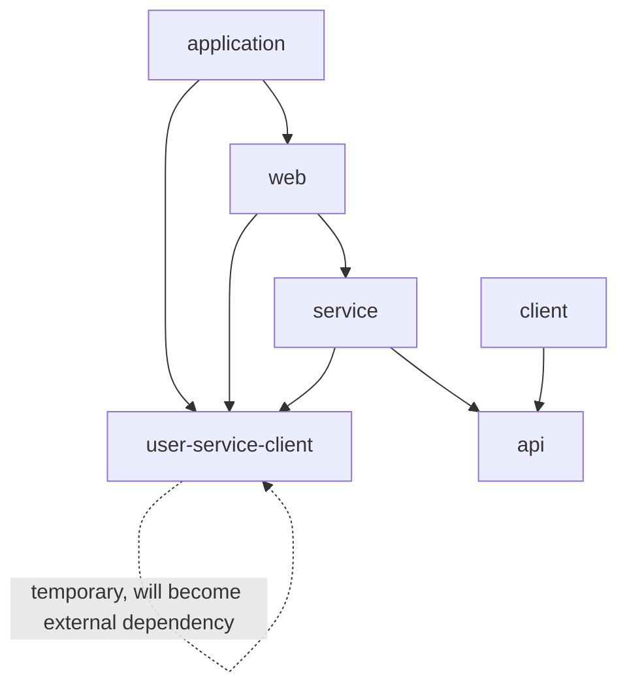
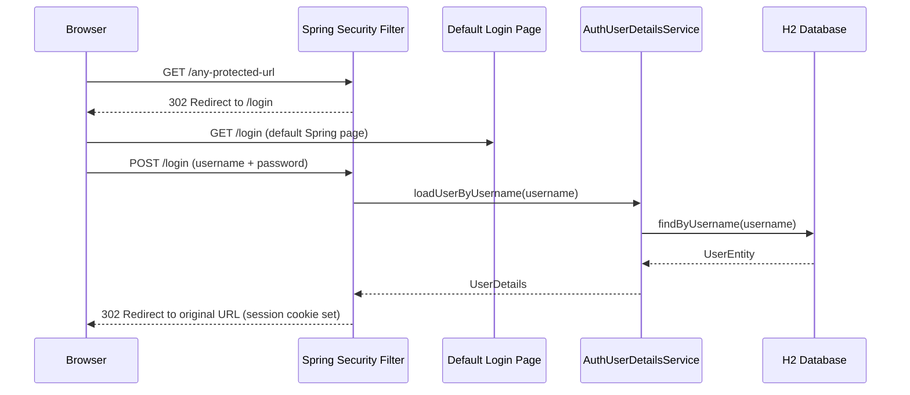

# Simple Auth Service

## Architecture

The auth-service follows the same multi-module Gradle structure as [service-template/settings.gradle.kts](service-template/settings.gradle.kts), reusing the `example-plugin` convention plugins and `coreLibs` version catalog.




## Module Breakdown

### 1. Gradle Scaffolding (mirrors `service-template`)

Create the following files by copying and adapting from `service-template`:

- `**auth-service/settings.gradle.kts**` -- Same as [service-template/settings.gradle.kts](service-template/settings.gradle.kts) but with `rootProject.name = "auth-service"`. Include modules: `user-service-client`, `api`, `client`, `service`, `web`, `application`.
- `**auth-service/build.gradle.kts**` -- Empty root, same as [service-template/build.gradle.kts](service-template/build.gradle.kts).
- `**auth-service/gradle.properties**` -- Set `group=com.example.auth`, `version=0.0.1-SNAPSHOT`, `coreCatalogVersion=0.0.1-SNAPSHOT`.
- `**auth-service/gradle/libs.versions.toml**` -- Same as [service-template/gradle/libs.versions.toml](service-template/gradle/libs.versions.toml).
- `**auth-service/buildSrc/build.gradle.kts**` -- Same as [service-template/buildSrc/build.gradle.kts](service-template/buildSrc/build.gradle.kts).
- `**auth-service/buildSrc/settings.gradle.kts**` -- Same as [service-template/buildSrc/settings.gradle.kts](service-template/buildSrc/settings.gradle.kts).
- `**auth-service/gradle/wrapper/**` -- Copy Gradle wrapper files from `service-template` (Gradle 9.3.1).

### 2. `user-service-client` Module (temporary)

This is a temporary submodule that will eventually be replaced by an external `user-service-client` dependency once the `user-service` is built. It contains all user-related API and persistence classes.

**Build:** Plugin `example.spring-module-conventions`, depends on `coreLibs.core.api`, `coreLibs.core.client`, `coreLibs.core.persistence`, `spring-boot-starter-validation`, `spring-boot-starter-data-jpa`.

**Files:**

- `UserResponse.kt` (package `com.example.user.api`) -- Data class with `id: Long`, `username: String`, `roles: Set<String>`.
- `UserEntity.kt` (package `com.example.user.persistence`) -- JPA `@Entity` with fields: `id` (generated), `username` (unique), `password` (BCrypt-encoded), `roles` (`@ElementCollection` eager-fetched `Set<String>`).
- `UserRepository.kt` (package `com.example.user.persistence`) -- `JpaRepository<UserEntity, Long>` with `fun findByUsername(username: String): UserEntity?`.

### 3. `api` Module

**Build:** Plugin `example.spring-module-conventions`, depends on `coreLibs.core.api` + `spring-boot-starter-validation`.

**Files (package `com.example.auth.api`):**

- `AuthApiPlaceholder.kt` -- Placeholder object (same pattern as service-template). Auth-specific DTOs can be added here in the future.

### 4. `service` Module

**Build:** Plugin `example.spring-module-conventions`, depends on `coreLibs.core.service`, `project(":api")`, `project(":user-service-client")`, `spring-boot-starter` and `spring-boot-starter-security`.

**Files (package `com.example.auth.service`):**

- `AuthUserDetailsService.kt` -- `@Service` implementing Spring Security `UserDetailsService`. Loads the user from `UserRepository.findByUsername()` (from `user-service-client`) and maps to `org.springframework.security.core.userdetails.User` with granted authorities from `roles`.

### 5. `web` Module

**Build:** Plugin `example.spring-module-conventions`, depends on `coreLibs.core.web`, `project(":service")`, `project(":user-service-client")`, `spring-boot-starter-web`, `spring-boot-starter-security`.

**Files (package `com.example.auth.web`):**

- `SecurityConfig.kt` -- `@Configuration` + `@EnableWebSecurity`. Defines a `SecurityFilterChain` bean:
  - `http.formLogin(Customizer.withDefaults())` -- enables the default Spring Security login page.
  - `http.logout { it.logoutSuccessUrl("/login?logout") }` -- redirect on logout.
  - `http.authorizeHttpRequests { it.requestMatchers("/login", "/css/**", "/js/**").permitAll().anyRequest().authenticated() }`.
  - `PasswordEncoder` bean returning `BCryptPasswordEncoder`.
- `UserController.kt` -- `@RestController` mapped to `/api/users`. Single endpoint `GET /api/users/me` returning the currently authenticated user as `UserResponse` (from `com.example.user.api`, extracted from `Principal`).

### 6. `client` Module

**Build:** Plugin `example.spring-module-conventions`, depends on `coreLibs.core.client`, `project(":api")`, `spring-boot-starter-webflux`. Contains only a placeholder object `AuthClientPlaceholder.kt` (same pattern as service-template).

### 7. `application` Module

**Build:** Plugin `example.kotlin-conventions` + `spring.boot`. Depends on `coreLibs.core.platform`, `coreLibs.core.application`, `project(":web")`, `project(":user-service-client")`, `spring-boot-starter`, and `runtimeOnly("com.h2database:h2")`.

**Files:**

- `AuthServiceApplication.kt` -- `@SpringBootApplication(scanBasePackages = ["com.example.auth", "com.example.user"])` with `main` function.
- `application.yaml` -- App name `auth-service`, default `local` profile, datasource placeholders, JPA `ddl-auto: validate`, port `8080`.
- `application-local.yaml` -- H2 in-memory DB config with `create-drop`, SQL logging, H2 console enabled, `defer-datasource-initialization: true`.
- `data.sql` -- Seed script that inserts a test user (`admin` / `admin`) with BCrypt-encoded password and an `ADMIN` role so the default login page is usable out of the box.

## Authentication Flow




## File Tree Summary

```
auth-service/
  build.gradle.kts
  settings.gradle.kts
  gradle.properties
  gradle/
    libs.versions.toml
    wrapper/
      gradle-wrapper.properties
  buildSrc/
    build.gradle.kts
    settings.gradle.kts
  user-service-client/                          # temporary submodule
    build.gradle.kts
    src/main/kotlin/com/example/user/api/
      UserResponse.kt
    src/main/kotlin/com/example/user/persistence/
      UserEntity.kt
      UserRepository.kt
  api/
    build.gradle.kts
    src/main/kotlin/com/example/auth/api/
      AuthApiPlaceholder.kt
  client/
    build.gradle.kts
    src/main/kotlin/com/example/auth/client/
      AuthClientPlaceholder.kt
  service/
    build.gradle.kts
    src/main/kotlin/com/example/auth/service/
      AuthUserDetailsService.kt
  web/
    build.gradle.kts
    src/main/kotlin/com/example/auth/web/
      SecurityConfig.kt
      UserController.kt
  application/
    build.gradle.kts
    src/main/kotlin/com/example/auth/application/
      AuthServiceApplication.kt
    src/main/resources/
      application.yaml
      application-local.yaml
      data.sql
```

